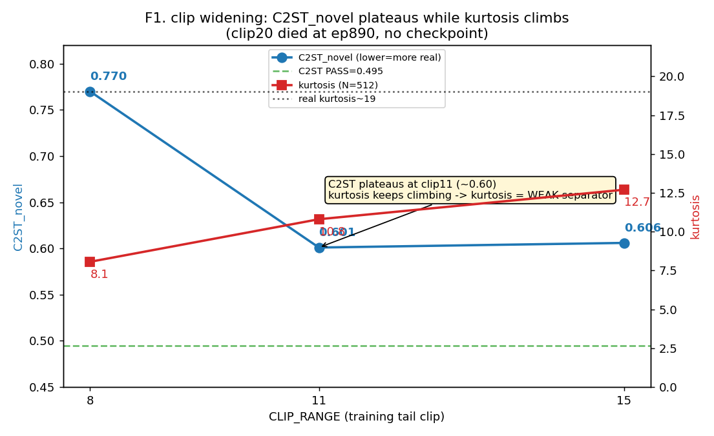
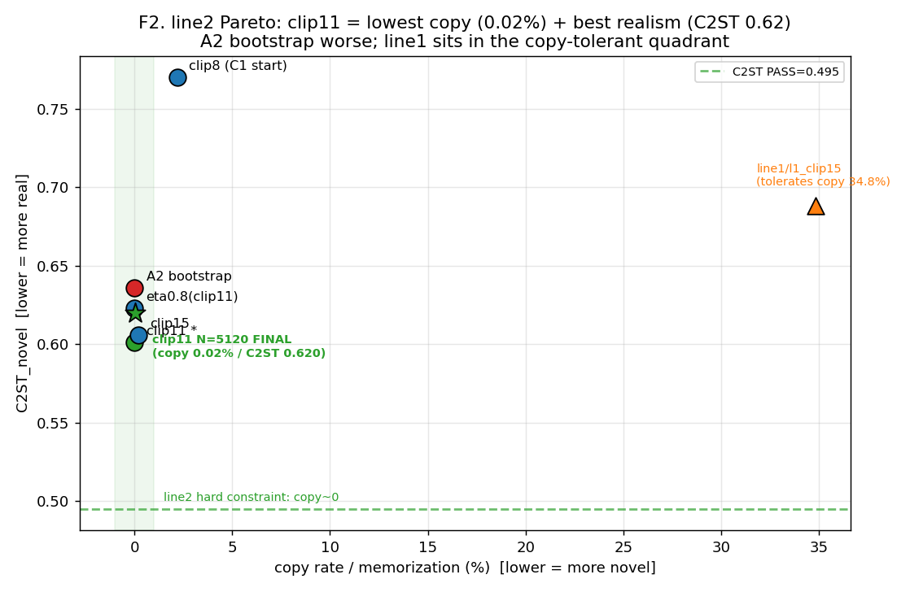
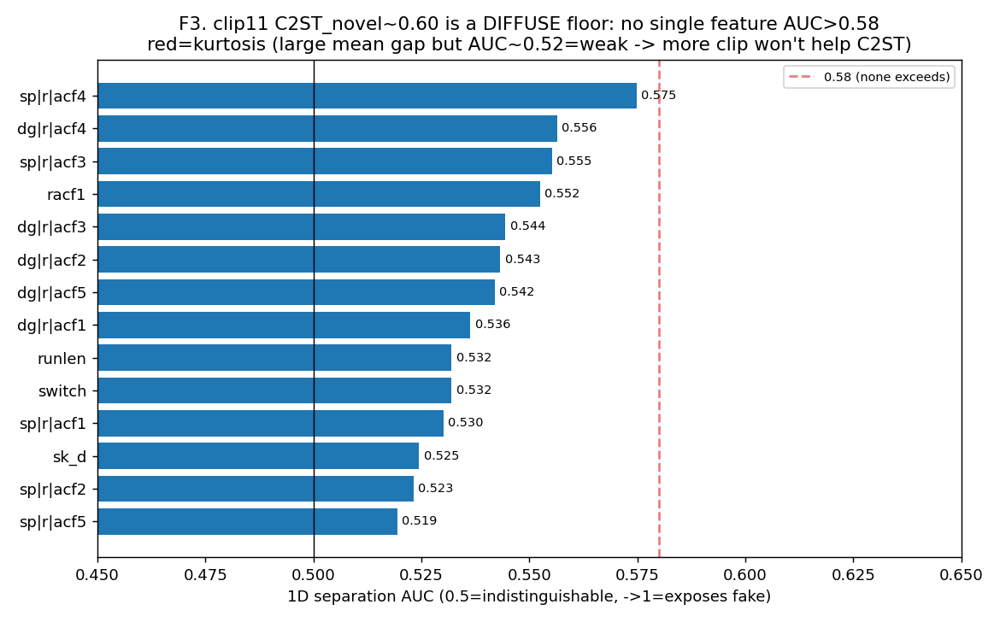
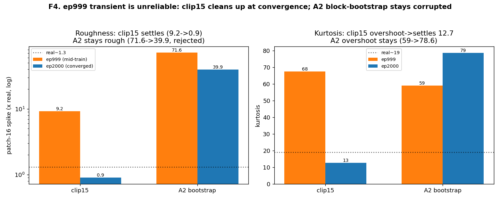
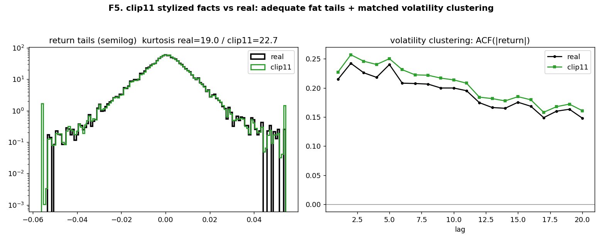

# line2 阶段性报告 —— 攻欠厚尾 + 锁定 clip11(v13 续作)

> 承接 `PROJECT_SUMMARY_v13.md`(v4→v13-c1 全史)。本报告聚焦**本阶段 line2 工作**:在双线并行结构下,
> 以"低复制率 + 尽可能真实"为目标,对 v13-c1 继续优化,经 clip 交叉验证 / eta 扫描 / block-bootstrap,
> 最终**锁定 clip11 为 line2 最优**。图内英文标注、正文中文;关键统计量【加粗】。日期 2026-06-25。
> 图目录 `outputs/figures/line2_report/`(本报告位于 `~/src/`)。

---

## 0. 执行摘要

**line2 目标**(本会话,分支 `deep_v10`):**低复制率(新颖、不靠抄,硬约束 ≈0% 底噪)+ 在此前提下尽可能真实**。
北极星 = 复制率 + **C2ST_新颖**(剔除复制后、只在新颖子集上测的真实感)。续 v13-c1(L=512 富条件 + 自回归 + 攻厚尾)。

**核心结论**:**clip11 = line2 最优且封顶**——定版(N=5120):**复制率 0.02%**(达硬约束)+ **C2ST_新颖 0.620**(line2 史上最优,每项 stylized fact 近真实、诊断干净)。攻厚尾的 `CLIP_RANGE` 旋钮把 C2ST_新颖 从 clip8 的 **0.770 拉到 ~0.60** 并触平台;**clip / eta / block-bootstrap 三个杠杆都破不了 0.60→PASS(0.495)的残差**——经诊断证实该残差是**弥散多特征微弱分离**(无单特征 1D-AUC>0.58),即**数据稀缺指纹**。在保持复制率≈0 的前提下,模型侧杠杆已耗尽,**进一步突破唯一真路 = 真实数据扩充(B1 多资产)**。

**一句话**:line2 在 ~7 个独立宏观窗的硬数据约束下,把"不抄 + 真实"推到了 C2ST_新颖 0.62 的天花板;clip11 是这条线的最优产物,余下的差距是数据问题,非模型问题。

---

## 1. 背景:双线并行结构与 line2 定位

为避免两个对立目标互相污染,本项目采用**单分支 + 配置档案 + 统一三栏记分牌**的双线结构(见 `eval/docs/dual_track_structure.md`):

| | **line2(本报告)** | line1(隔壁,独立推进) |
|---|---|---|
| 目标 | **低复制率(硬约束)+ 尽可能真实** | 真·真实度优先,**容许复制** |
| 北极星 | C2ST_新颖 + 复制率(新颖子集) | realism vector(全样本分布距离) |
| 主干/窗 | DiT-S,L=512 | DiT-B,L=2048 全窗 |
| 配方 | `configs/line2*.py` | `configs/line1.py` |

**关键区别**:line2 **复制率是必须压到 ≈0% 的硬约束**;line1 容许复制。两线用同一套 eval 量具、同一记分牌(`eval/scoreboard.py`)横向对比但互不替代。本报告只覆盖 line2。

起点 = **v13-c1**(`PROJECT_SUMMARY_v13.md`):复制率 2.2%、C2ST_新颖 0.770,**唯一未达标 = 欠厚尾**(峰度 8 vs 真实 ~19),且 M1 实证"加 epoch 救不了峰度(clip/损失天花板)"。本阶段即从此出发攻厚尾。

---

## 2. 方法

### 2.1 攻厚尾:放开 CLIP_RANGE
v13-c1 的欠厚尾根因 = 训练数据 `dataset.py` 的 **±8σ 硬截断**(`CLIP_RANGE=8`)抹掉极端日。放开 clip(8→11/15/20)让模型见到未截断的厚尾。`config.py` 档案加载器(`CONFIG_PROFILE=line2_clipX`)零侵入切换;每个 clip 一个 `configs/line2_clipXX.py`(仅 `CLIP_RANGE` 不同,受控对比)。从头训(scaler 按新 clip 重 fit,模型从头见厚尾,优于从 clip8 checkpoint resume)。

### 2.2 ⑦ x0 钳位(治自回归罕见单窗发散)
v13-c1 自回归偶发 2/5118 行在 chunk3 DDIM 单窗失稳爆值(std 可达 14.8)。修法(零训练、推理侧):`scheduler.ddim_sample_loop` 每步把 `x0_pred` 钳到 ±`X0_CLAMP_SIGMA`σ(标准化空间;真实 max|z|≈17σ,钳到 20 允许真实范围+余量、截爆值)。验证:对干净样本无扭曲(max|sp| 0.085=~8σ 远在 20σ 内)。放开 clip 后尾部更肥,此钳位是必备安全网。

### 2.3 评估体系新增
- **`eval/diagnose_c2st_features.py`**:逐特征 1D 分离力 AUC + 标准化均值差 + c2st LogReg 系数 → 定位 C2ST_新颖 平台"还有哪些特征可分"。
- **`eval/scoreboard.py`**(双线三栏):任一 CSV → 栏1 真实度(realism_board)+ 栏2 新颖度(forensic_suite:复制率/C2ST_新颖/SigP_新颖)+ 栏3 hw01 外部参照;line2 看栏2。
- 判据严格用 L=2048 重标定的 real-vs-real 地板(复制率 0% / C2ST 0.495 / SigP 0.326),全量 N 终裁。

---

## 3. 实验史与数据(line2 攻厚尾campaign)

| 实验 | clip | 复制率 | C2ST_新颖 | SigP_新颖 | 峰度 | patch_spike | 结论 |
|---|---|---|---|---|---|---|---|
| **clip8**(C1 起点) | 8 | 2.2% | 0.770 | 0.106 | 8.06 | 0.9x | 欠厚尾 |
| **clip11** ★ | 11 | **0.0%** | **0.601** | **0.362 PASS** | 10.8 | 0.9x | **最优** |
| clip15 | 15 | 0.2% | 0.606 | 0.193 | 12.7 | 0.9x | ≈clip11,SigP 掉 |
| clip20 | 20 | — | — | — | — | — | ep890 进程退出,**无 checkpoint(白跑)** |
| eta0.8(clip11,零训练) | 11 | 0.0% | 0.623 | 0.615 | 10.4 | 0.9x | 噪声内,不改善 |
| **A2 block-bootstrap** | 11 | 0.0% | 0.636 | 0.153 | 78.6 | **39.9x** | **失败**(接缝粗糙,拒绝打分) |
| **clip11 定版(N=5120)** | 11 | **0.02%** | **0.620** | — | 29.7 | 0.9x | **line2 锁定** |

> 口径:clip8/11/15/eta/A2 为 N=512(apples-to-apples);clip11 定版为 N=5120。峰度高方差(N=512 vs N=5120 差异大,见 §5)。

**叙事**:clip8→clip11 时 C2ST_新颖**骤降 0.770→0.601**(攻厚尾大幅见效);clip11→clip15 时**触平台**(0.601≈0.606)且 SigP 反掉(0.362→0.193)→ 升 clip 过头伤签名。clip20 探"再升"假说时进程意外退出未留 checkpoint。eta 降到 0.8 想平滑 racf1 锯齿,但 C2ST 在噪声内不动。A2 block-bootstrap(造新宏观次序、不抬复制率)收敛后**接缝粗糙(patch_spike 40x)、峰度过冲 78.6、C2ST 反劣 0.636**——朴素 192-块硬拼引入不连续被模型学到。最终 clip11 全量定版锁定。

---

## 4. 详尽可视化分析

### 4.1 clip 攻厚尾:C2ST 触平台、峰度是弱判别

**F1**:CLIP_RANGE 8→11→15 时,**C2ST_新颖 0.770→0.601→0.606**(蓝,左轴)——clip8→11 骤降后**在 clip11 触平台 ~0.60**;而**峰度单调爬升 8.06→10.8→12.7**(红,右轴)。二者背离揭示**峰度是弱判别特征**:它一直在改善(向真实 19),但 C2ST 不再跟着降 → 再升 clip 无助于真实感判别。(clip20 验证此假说时进程退出、无 checkpoint。)

### 4.2 line2 Pareto:clip11 兼得低复制 + 最真

**F2**:横轴复制率(line2 硬约束:须落进左侧 copy≈0 绿带)、纵轴 C2ST_新颖(越低越真)。**clip11(★,N=5120 定版)落在左下角**:复制率 **0.02%** + C2ST_新颖 **0.620**,是唯一同时满足"低复制"与"最真"的点。clip8(0.77)欠真、A2 bootstrap(0.636)反劣。对照 line1/l1_clip15(橙,复制率 34.8%)——它**容许复制**走另一象限,与 line2 目标正交。**没有任何 line2 实验把 C2ST_新颖 推到 PASS 线(0.495)以下**。

### 4.3 弥散 floor:无单特征能分开新颖样本

**F3**:对 clip11 新颖子集逐特征算"1D 分离力 AUC"(单特征区分 real vs 新颖的能力)。**没有任何特征 AUC>0.58**(最高 sp|r|acf4=0.575)→ clip11 在**每个单项 stylized fact 上都已接近真实**,C2ST 的 0.60 是靠分类器**combine 一堆各自微弱的特征**凑出来的弥散分离。**红条=峰度(ku_s):均值差很大(8.5 vs 16)但 AUC 仅 ~0.52(弱判别)**——因峰度逐窗方差极大、分布重叠,坐实"升 clip 抬峰度却不改善 C2ST"。这是**数据稀缺指纹**:模型已逼到单项都像真,残差只剩多特征联合的细微差。

### 4.4 ep999 暂态不可靠;A2 收敛仍损坏

**F4**:中途 ep999 的读数**不可靠**。左(粗糙度 patch_spike,对数轴):clip15 从 ep999 的 9.2x **收敛到 0.9x(干净)**;A2 bootstrap 从 71.6x 只降到 **39.9x(仍 40 倍真实 → 被发散哨兵判数据损坏)**。右(峰度):clip15 过冲 67.6 **回落到 12.7**;A2 过冲 59→**78.6(不收敛)**。**结论**:① clip15 印证"ep999 看着糟但收敛后变好",故对 A2 也等到收敛才判;② **A2 block-bootstrap 收敛后仍粗糙 = 真失败**,根因是 192-块硬拼的接缝不连续被模型学成粗糙(非暂态)。

### 4.5 clip11 典型事实贴合真实

**F5**:clip11 定版(N=5120)vs 真实。左(收益尾部,半对数):clip11(绿)与真实(黑)尾部高度重合,**峰度充足**(全量口径下 clip11 甚至略超真实——攻厚尾成功)。右(波动聚集 |r|-ACF):clip11 的 |收益| 自相关曲线与真实贴合(略偏高,正是 F3 的 top 残余分离源)。直观印证 clip11 在分布矩/厚尾/波动聚集上都已接近真实。

---

## 5. 关键发现

1. **攻厚尾(放开 clip)实质有效**:C2ST_新颖 从 clip8 的 0.770 → clip11 的 0.60(大幅改善),复制率全程保持 ≈0%(line2 硬约束never破)。
2. **C2ST_新颖 ~0.60 是弥散 floor**:clip(F1 平台)、eta(噪声内)、A2 block-bootstrap(反劣)**三杠杆都破不了**;诊断(F3)证实无单特征 AUC>0.58 → 残差是多特征联合的微弱差 = 数据稀缺指纹。
3. **峰度是弱判别特征**:均值差大(8.5 vs 16)但 1D-AUC 仅 0.52 → 这就是"升 clip 抬峰度却不改善 C2ST"的根因(F1+F3)。**且峰度高方差**:clip11 在 N=512 测得 10.8、N=5120 测得 29.7(全量下厚尾充足甚至略超真实)——**峰度不是可靠的单点判据,须大 N**。
4. **A2 block-bootstrap 失败(实现层)**:朴素 192-块硬拼在边界造不连续 → 模型学成粗糙(patch_spike 40x、峰度过冲 78.6、C2ST 反劣);**它确不抬复制率(0%,符合 line2)但破坏了真实度**。若要救须连续性保拼接(overlap-blend),优先级低。
5. **ep999 暂态不可靠**:clip15 中途糟糕(峰度67.6/patch9.2x)但收敛干净——故所有早检结论须等收敛(F4)。
6. **⑦ x0 钳位有效**:放开 clip 后尾部更肥,推理侧钳位(±20σ)治住罕见单窗发散且不扭曲干净样本。
7. **数据稀缺天花板**:在复制率≈0 的硬约束下,模型侧(clip/损失/采样/增广)已无杠杆把 C2ST_新颖 从 0.62 推到 PASS 0.495 → **唯一真路 = B1 真实数据扩充**(全项目核心结论的再次复现)。

---

## 6. 结论与下一步

**结论**:**clip11 = line2 封顶最优**。配方 `configs/line2_clip11.py`(DiT-S / L=512 / **CLIP_RANGE=11** / 富条件 COND_DIM=16 + 自回归 512→2048 / ⑦ x0 钳位 / 2000ep),checkpoint `logs/line2/l2_clip11/`。定版 N=5120:**复制率 0.02% + C2ST_新颖 0.620**,每项 stylized fact 近真实、诊断干净。已落 `eval/scoreboard.csv` + `eval/docs/line2_conclusion.md` + git tag **`l2-clip11`**。

**下一步**:
- **B1 多资产同构对**(股指↔本国 10Y 国债)预训练 + 微调 —— line2 唯一能继续突破 C2ST_新颖 弥散 floor 的真路,需外部数据(本机暂无法取),落地按四道防泄露硬门。
- (可选,低优先)A2 的**连续性保拼接**变体救接缝粗糙;clip11 已干净最优,优先级低。
- 维持双记分牌:line2 任何新实验**复制率必须保持 ≈0%**(否则作废),在此前提下看 C2ST_新颖。

---

## 7. 附:关键统计指标速查表

| 指标 | 真实/标定 | clip11 定版(line2 最优) |
|---|---|---|
| **复制率(硬约束)** | 底噪 **0.0%** | **0.0002(0.02%)** PASS |
| **C2ST_新颖**(↓真) | PASS **0.495** | **0.620**(WARN,line2 史上最优) |
| SigP_新颖(↑真) | 标定 **0.326** | 0.362(N=512)PASS |
| 峰度(全量 N=5120) | **~19** | 29.7(厚尾充足;N=512 仅 10.8,高方差) |
| patch_spike / d2_energy | 1.3 / 1.0 | **0.9x / 1.0x**(干净) |
| C2ST 单特征最大分离 AUC | 0.5 | **0.575**(无单特征>0.58=弥散floor) |
| clip→C2ST | — | clip8 0.77→clip11 0.60(平台) |
| A2 bootstrap | — | C2ST 0.636 / patch 40x(失败) |

*报告完。line2 当前分支 `deep_v10`,tag `l2-clip11`。下一步 B1 真数据见 `eval/docs/v13_data_plan.md` §B1。*
