# 金融时间序列扩散模型 —— 阶段性项目总结（v13）

> 撰稿口径：本报告主体截至 **v13 A1（缩窗 L=512）**完成、**v13 C1** 评估进行中时冻结。**2026-06-28 追加 §5.5「v13 之后最新模型横向对比」**：C1 已评定（发散经 ⑦ 钳位治愈）、新增 **line2 clip11 ★**（line2 收官最优）与 **v14-fusion ★**（最新多通道线，历代最强单窗）；§4 叙事/版本表、§9 速查表已同步这些最新模型。所有统计量取自项目 eval 量具实测与诊断图，关键数字均在表中【加粗】标注。图片以相对路径 `outputs/figures/summary_v13/<文件名>` 内嵌（本报告位于 `/home/u00134/src/`）。

---

## 0. 执行摘要

**这是什么项目。** 用一个 **1D Diffusion Transformer（DiT-B，实测 57.93M ≈ 58M 参数）**，在 ε-prediction 扩散框架下生成 **2 通道日频金融时间序列**：通道 0 = SP500 日 log 收益率，通道 1 = DGS10（美债 10Y 收益率）日差分。底层数学为 `T=1000`、线性 β schedule（1e-4→0.02）、ε 预测训练、**广义 DDIM（含 eta 随机性）+ Classifier-Free Guidance（CFG）**采样。

**双重目标。** （1）一个可靠的**生成模型**——生成的路径在分布矩、波动聚集、regime 结构、尾部相关等"典型事实（stylized facts）"上逼近真实；（2）一个**取证打分 / 鉴别器**——对第三方提交的伪造数据给出可靠的"像不像真实市场"的判定与排序。这两个目标由**同一根脊梁**贯通：分布散度 `D(P_real, Q)`——当 Q 是生成器输出时它是训练损失，当 Q 是他人候选时它是取证打分器。

**当前最佳判定的演变。** 既往认定 **v10_retrained**（min-SNR γ=5 + stylized-fact 辅助损失 + clip 8σ，12000 ep）为最佳模型；但**记忆化量具揭穿**这一判定被污染——v10_retrained 的复制率高达 **53.9%**（近半生成样本是训练窗的近乎逐点复制，Pearson 0.9999），其"真实感"半数来自抄袭训练数据。**诚实排名**（只在剔除复制后的新颖子集上评估）显示：**所有模型 C2ST_新颖 在 0.72–0.90，远高于 real-vs-real 标定 0.495 → 当前没有任何模型能生成令人信服的新颖数据。**

**头号病根。** **全模型严重记忆化训练集，根因是数据稀缺**——14734 行 / 2048 ≈ **仅约 7.2 个独立宏观窗** vs 58M 参数。记忆化与过平滑构成一条被锁死的 **Pareto 张力**：多记忆→签名真实度好（但靠抄），少记忆→复制少 + stylized 好但签名塌 / 过平滑。

**v13 进展。** A1 把窗从 2048 缩到 **512**（独立段 7.2→28.8，×4，零新数据 / 零合成 / 零失真），机制性把复制率压到史上最低 **14.5%**、C2ST_新颖压到史上最优 **0.722**；**但代价是签名律塌（SigP_新颖 0.003）与长程结构塌陷**（拼回 2048 后 regime 持续期仍 44 vs 真实 33、std 萎缩 0.0077 vs 0.0105、高波动占比 gap −0.24）。C1 富条件自回归**已修好 A1 的签名与长程塌**（复制 2.2% / SigP_新颖 0.106 / 长程对齐；早期"数值发散 std≈0.105 / 峰度≈40026"经查实为 2/5118 行单窗失稳、由 ⑦ x0 钳位治愈，非全局问题，详见 §5.5）。

**一句话结论。** 在 ~7 个独立宏观窗的硬数据约束下，"既新颖又逼真"的金融序列生成**仍未完全达标**；模型侧（损失 / 架构 / 采样 / 正则 / 缩窗）只是在同一堵 58M/7 的墙上挪动 Pareto 前沿——**治本唯一方向是数据**（不失真地增加独立信号）。

**📌 报告冻结后的进展（见 §5.5）。** 三个最新模型把前沿继续推进：**v13 C1** 修好了 A1 的签名/长程塌（复制 2.2% / SigP_新颖 0.106 / 长程对齐），**line2 clip11 ★** 在低复制硬约束下把 C2ST_新颖压到史上最优 **0.620** 且厚尾达真实量级（复制 0.02% / 峰度~19 / SigP 0.362 PASS），**v14-fusion native ★**（多通道）是历代最强单窗（复制 4.9% / C2ST_新颖 0.632 / 真厚尾 21.7 / 诊断全干净，真实度+复制率双优）。**C2ST_新颖天花板从 A1 时的"全模型 0.72+"降到 0.62**——前进显著，但 0.62 仍 > 标定 0.495，残差被诊断证实是**弥散数据稀缺指纹**；且 v14-fusion 诚实坐实"多通道本身不增独立窗"。**结论方向不变：治本仍唯数据（B1 真数据）。**

---

## 1. 项目背景与双重目标

### 1.1 数据与任务

- **真实数据**：绝对路径 `/home/u00134/data/train_sp500_us10y.csv`，列 `sp500, DGS10`，共 **14734 行**日频观测。
- **实测真实统计**：SP500 std=**0.01055**、超额峰度=**18.80**（全 14734 行口径；分布图按 3000 样本口径算得 21.80，同量级）、偏度=**−0.679**；DGS10 std=**0.0669**、超额峰度=**8.39**。
- **建模空间**：模型不直接学价格 / 利率，而是学**已标准化（逐通道 z-score + ±8σ clip）空间**里的双通道序列，生成后由 `scaler.inverse_transform` 还原到真实量级。

### 1.2 双重目标与"签名散度脊梁"

| 目标 | 内涵 | 实现侧 |
|---|---|---|
| 生成器 | 路径在典型事实上逼近真实 | DiT-B + 扩散 + 辅助损失 |
| 取证打分 / 鉴别器 | 判第三方伪造数据"像不像真" | score.py（fidelity）+ c2st / signature（非自指）+ memorization / novelty_rerank |

**脊梁思想**：同一分布散度 `D(P_real, Q)`，当 `Q=生成分布`时是**训练损失**（最小化即把生成推向真实，这是 v11 把可微 Sig-MMD 接入 losses.py 的动机）；当 `Q=候选分布`时是**取证打分器**（D 越大越假）。`signature.py` 的 `sig_mmd_test` 即此思想的取证落地。**取证第一原则是"非自指（data-vs-data）"**：直接拿候选比真实，绝不经由被污染的"模型"中介（见 §3 ddpm_mse 自指缺陷）。

---

## 2. 模型与训练原理

> 重要前提：`config.py` **当前为 v13 状态**（`SEQ_LEN=512`、`STRIDE=2`、`USE_CONTEXT_COND=True` 故 `COND_DIM=16`），历史训练（v9–v12）使用 `SEQ_LEN=2048`、`cond_dim=2`。`dit1d.py` 文件头若干旧注释（num_patches=128、DiT-S ~25M、DiT-B ~55M）是 2048 时代遗留，已脱节。**经实测**（seq_len=512）：DiT-B = **57.93M**、DiT-S = **32.64M**、`num_patches=512/16=32`。

### 2.1 总体设定

- 通道 0 = SP500 日 log 收益、通道 1 = DGS10 日差分（`CHANNELS=2`）。
- 序列长度 `SEQ_LEN`：v13 当前 = **512**（`num_patches=32` 自适应），历史 = 2048。缩窗目的：把"独立 SEQ_LEN 段"从 ~7.2 提到 ~28.8，直击数据稀缺导致的记忆化；`STRIDE` 同步 5→2 以维持训练窗数（~7100 窗）。
- 扩散总步数 `T=1000`；**线性 β schedule**，`BETA_START=1e-4`、`BETA_END=0.02`。
- 预测目标：**ε-prediction**（网络输出预测注入的高斯噪声 ε̂）。
- 采样：**广义 DDIM**（含 eta 随机性旋钮），支持 CFG。生成默认工作点：`GEN_ETA=1.0`、`GEN_NUM_STEPS=200`、`GEN_GUIDANCE_SCALE=1.0`。

### 2.2 扩散数学

**前向加噪 q(x_t | x_0)**（一步闭式）：

```
x_t = √ᾱ_t · x_0 + √(1−ᾱ_t) · ε,   ε ~ N(0, I)
α_t = 1 − β_t,   ᾱ_t = ∏_{s≤t} α_s
```

系数 √ᾱ_t、√(1−ᾱ_t) 预计算成 buffer，按 batch 的 t 取出 reshape 成 (B,1,1) 广播到 (B,2,L)。

**ε 预测训练目标**：对随机 t、随机 ε，最小化 `MSE(ε̂_θ(x_t, t, c), ε)`。由 ε̂ 反演干净样本：`x̂₀ = (x_t − √(1−ᾱ_t)·ε̂) / √ᾱ_t`，该反演在辅助损失与 DDIM 采样中复用。

**DDPM ancestral 采样**（逐步 T→0）：

```
μ_θ = (1/√α_t) · (x_t − β_t/√(1−ᾱ_t) · ε̂)
x_{t−1} = μ_θ + √β̃_t · z       (t>0; t=0 返回 μ)
β̃_t = β_t · (1−ᾱ_{t−1})/(1−ᾱ_t),  posterior_variance[0]=0
```

**广义 DDIM 采样 + CFG**（核心生成路径）：
1. 时间步子序列 `times = round(linspace(-1, T-1, steps+1))`，从后往前迭代（steps=200，首步含哨兵 −1 表示 ᾱ=1）。
2. **CFG 单次双前向**：x、t 各复制一份拼 batch，条件侧 `c_double = cat([c, c_null])`（`c_null=0`），一次前向得 `eps_cond`、`eps_uncond`。
3. **CFG 外推**：`ε_pred = ε_uncond + w·(ε_cond − ε_uncond)`，w=1 纯有条件、w=0 纯无条件、w>1 放大条件。
4. 预测 x0：`x0_pred = (x − √(1−ᾱ_curr)·ε_pred)/√ᾱ_curr`。
5. **eta 随机性**：`σ_t = eta·√((1−ᾱ_prev)/(1−ᾱ_curr))·√(1 − ᾱ_curr/ᾱ_prev)`。eta=0→σ=0（确定性 DDIM，偏平滑）；eta→1→接近 DDPM ancestral，注入高频纹理 / 波动爆发，修复"过平滑 / regime 黏滞"。
6. 方向项扣除随机方差守恒总方差：`dir_xt = √(clamp(1−ᾱ_prev−σ², min=0))·ε_pred`。
7. 更新：`x = √ᾱ_prev·x0_pred + dir_xt`，再（eta>0 且 t_prev≥0）加 `σ·z`。

eta 是确定性 DDIM 与随机 DDPM 之间的连续插值——把 eta 拉到 1 注入末段随机性，是 v10"零重训"提分的关键。

### 2.3 主干 DiT（`dit1d.py`）

- **Patchify**：`Conv1d(2, hidden, kernel=stride=16)` 把每 16 步压成 1 token，token 数 N = L/16（L=512→32；L=2048→128）。`assert seq_len % patch_size == 0`。
- **正弦位置编码**：不可学习 buffer，patchify 后逐 token 相加。
- **adaLN-Zero 条件注入**（DiT 核心）：用非仿射 `LayerNorm`，每 block 从条件嵌入经 `SiLU→Linear(hidden, 6·hidden)` 预测 6 个 D 维向量 γ₁β₁α₁（注意力分支 scale/shift/门控）与 γ₂β₂α₂（MLP 分支）；调制 `modulate(x,shift,scale)=x·(1+scale)+shift`，门控残差 `x = x + α·分支(...)`。**Zero 初始化**：`adaLN_modulation` 末层 + `final_adaLN` + `unpatchify_proj` 全零 → 初始每 block 恒等、网络初始输出 ≈ 0（与 ε~N(0,I) 先验一致），训练稳定。
- **条件融合**：`cond_emb = t_emb + c_emb`（时间步嵌入 + 条件嵌入，**直接相加**）；c=None 时 `c_emb=0`，即 CFG 无条件分支。
- **注意力 / MLP**：`MultiheadAttention`（全局注意力，每 token 关注所有 token，天然覆盖长依赖）；MLP `Linear(hidden,4·hidden)→GELU→Linear`（mlp_ratio=4）。
- **Final + Unpatchify**：`final_norm` 调制后 `Linear(hidden, 16·2=32)`，reshape `(B,N,32)→(B,2,L)` 输出 ε̂。

**实测参数量（seq_len=512）**：DiT-B（512/12/8）=**57.93M**（默认主力）；DiT-S（384/12/6）=**32.64M**（v12 抗记忆缩容用）；DiT-L（768/24/12，~200M，未用于主线）。参数量几乎不随 cond_dim（2 vs 16）变化。

### 2.4 数据管道（`dataset.py`）

- **标准化**：逐通道 z-score + 硬截断。`transform: x_norm = clamp((x−mean)/std, ±CLIP_RANGE)`，`CLIP_RANGE=8.0`（v10 Phase2 由 5→8，保尾部驱动波动爆发）；`inverse_transform: x·std+mean`（**不反截断**，允许偶尔超 ±8σ）。
- **滑窗**：`indices = range(0, N−seq_len+1, STRIDE)`，`STRIDE=2`；`__getitem__` 取 (2, seq_len)。
- **条件语义 c**：原始 `c=window[0]`（2 维初值，与波动相关 ≈0.02，信息近乎无用）；v13 C1（当前）改为**前置上下文窗的富统计向量**，每通道 `N_CTX_FEAT=8` 特征 ×2 通道 = **16 维**。`_ctx_stats` 8 维：std、|r|均值、均值、|r|-acf1（波动聚集）、skew、超额峰度、末值、二阶差分能量。设计意图：让模型从"上下文状态"泛化续写而非背诵固定起点，配合缩窗 + 自回归拼接重建 2048。**强制做消融**（zero-ctx vs real-ctx 的 regime 分布，无差异即停，防 Sig-MMD 式 no-op）。
- **v13 A2 block-bootstrap 增广**（默认关）：`BLOCK_LEN=192` 真实块首尾相接 + 随机裁剪，`BOOT_FRAC=0.3`，保块内 stylized fact、只造新宏观次序排列——**绝不凸组合 / 插值 / 加噪**（后者削尾）。

### 2.5 损失（`losses.py`）

总损失 `loss = loss_mse + loss_acf + loss_rough + loss_sig`：

- **(a) min-SNR-γ 加权 MSE**（`USE_MIN_SNR=True`, `γ=5.0`）：逐样本权重 `w = min(1, γ/SNR_t)`，`SNR_t=ᾱ_t/(1−ᾱ_t)`，抑制低噪声步主导、加速收敛。
- **(b) stylized-fact 辅助损失**（`USE_AUX_LOSS=True`）：由 ε̂ 反演的 x̂₀ 对真实 x₀ 罚高阶结构。|r|-ACF L1（lag 1..5，权重 0.05，波动聚集）+ 二阶差分能量相对差距（仅 sp 通道，权重 0.05，roughness）；**门控**仅在 `ᾱ_t>0.1` 的可靠样本上施加、按 ᾱ_t 加权。直接攻击 ε-MSE 均值寻优忽略的尖峰 / 聚集结构。
- **(c) 可微 Sig-MMD**（depth-2，w=0.05，**默认关——已证实无效死重**）：向量化截断签名（S1 净增量 + S2 迭代积分）→ 无偏 RBF-MMD²（median 带宽，detach 防漂移）。**结论**：早早（ep~190）卡在 MMD² 噪声地板 ~−0.001、全程无持续梯度；v11_noSig 消融证实它是 no-op，应移除。

**可微性铁律**：损失路径内不得出现 `.item()`/numpy/数据依赖整数索引；子窗起点用 `torch.randint`。

### 2.6 训练（`train.py`）

- **优化器** `AdamW(lr=2e-4, weight_decay=1e-2)`（wd v12 由 1e-3→1e-2，10x 正则配合 DiT-S 抗记忆）。
- **LR 调度** warmup（前 200 ep 线性升温）+ 余弦退火（eta_min=1e-6）。
- **EMA** decay=0.995，生成默认用 EMA 权重。
- **梯度裁剪** max_norm=1.0。
- **CFG 条件丢弃** 每步 15% 概率把 c 置零（训练无条件分支）。
- **Checkpoint** 每 1000 ep（v12 改密集存档供采样侧 memorization/novelty 选 ckpt 早停）。

**关键机制——"过优化 eps-MSE 至 ~0.001 反而样本更差"**：在 ~2538（历史）重叠窗 / 仅约 7 个独立段 vs 58M 参数的极端稀缺下，把 eps-MSE 从 ~0.61 压到 ~0.001 = 过拟合去噪目标。ε-MSE 是均值寻优（mode-averaging），DDIM 末步又输出 x0 均值，二者叠加使路径比真实更平滑、波动爆发不足、regime 太黏（过平滑 / 欠离散），且半数输出近乎逐点复制训练窗（复制率 53.9%）。**更低训练 MSE ≠ 更好样本**——它衡量到模型自身（过平滑）流形的距离而非到真实数据律的距离。治本在数据，而非压损失。

### 2.7 采样与长程

- **单窗 DDIM（`generate.py`）**：加载 EMA + scaler，按 checkpoint 旁 `config.json` 复原结构超参（防 config.py 漂移）；`--cond_mode dataset` 抽真实条件 / `zero` 用 null；命令行可覆盖 eta/steps/w/seed/no_ema。
- **C1 自回归长程（`generate_autoregressive.py`）**：把 512 短窗链式拼成 2048（k=4）。仅适用 cond_dim>2 的 C1 富条件模型；每窗以前一窗 `ctx_features(x0).detach()`（与训练 `_ctx_stats` 同口径同顺序）为条件，朴素首尾拼接，**严禁用真实数据填缝**；含 `--force_null` 消融臂（恒零条件，验证 context 是否真被用上）。

### 2.8 贯穿全项目的工程不变量

- 所有扩散系数（β/α/ᾱ/√·/β̃）预计算为 buffer，不参与梯度。
- 全部高阶结构 / 签名计算在**标准化空间**进行（x̂₀ 与 x₀ 同空间）。
- `forward(x,t,c)` 接口 U-Net 与 DiT 兼容；c=None / 零向量即 CFG 无条件分支。
- 生成端永远从 checkpoint 旁 `config.json` 复原结构超参，避免 SEQ_LEN 2048→512 漂移导致加载错配。

---

## 3. 取证评估系统原理

### 3.1 `score.py`：10 项加权 fidelity 评分体系

`FinancialScorer` 给候选 0–100 分。`calibrate_from_real()` 用真实数据逐滑窗（stride=5）算各指标 baseline 均值 / 标准差作自适应 σ；`score_batch()` 用自适应指数衰减 / 分位数评分映射到 0–100 加权汇总。

**10 项指标与权重（v11 重设计，权重和严格=1.0，文件末尾 assert 守护）**：

| 项 | 权重 | 评分家族 |
|---|---|---|
| `ddpm_mse` | **0.05** ⚠ 自指 | 隐式物理分布（模型 ε 预测） |
| `sp_skew` | 0.08 | 高阶矩 |
| `sp_kurt` | 0.10 | 高阶矩 |
| `dg_skew` | 0.07 | 高阶矩 |
| `dg_kurt` | 0.13 | 高阶矩 |
| `sp_acf` | 0.12 | 波动率聚集（\|r\| ACF Lag1-10） |
| `dg_acf` | 0.12 | 波动率聚集 |
| `uncond_corr` | 0.10 | 联合分布（两通道相关） |
| `tail_corr` | 0.10 | 极端尾部相关 |
| `wasserstein` | 0.13 | 分布距离（Joint 1D Wasserstein） |

自适应指数衰减 `score = 100·exp(−|fake−μ| / max(σ, 0.1|μ|, 0.01))`。

### 3.2 ddpm_mse 的【自指缺陷】

`compute_ddpm_mse_per_path()` 把候选标准化 → t=200 加噪 → 用**本项目训练好的（过平滑）模型**预测噪声 → 取 ε 预测 MSE。问题：

> 它衡量候选到"**模型自身（过平滑）流形**"的距离，**而非**到**真实数据**的距离。

评分模型本身有"过平滑 / 欠离散"病根，去噪流形比真实更平滑。因此一个**比训练模型更真实**的候选（如 v10 重训），其路径离过平滑流形反而更远 → ddpm_mse 给它更高 MSE / 更低分 → **惩罚了更真实的候选**。这就是已实证的"ddpm_mse 悖论"（v10 重训旧打分 44.39 vs 取证重打 55.82）。

**v11 重设计 4 处**：① 权重 0.20→0.05 并标注"自指"，释放的 0.15 重分配给 data-vs-data 指标（峰度 + / ACF + / Wasserstein +）；② 代码内显式标注 self-referential；③ 权重和=1.0 + 自检 Wasserstein 由"硬编码 100 分"改为**真实两半互算的诚实地板**（自检上限不再虚高，实测 52.47）；④ 新增 `--forensic` headline（独立非自指结论，不混入 fidelity 总分）。

**使用守则**：判生成质量**勿用 ddpm_mse TOTAL 把关**，改用 wasserstein / 峰度 / diagnostics / 非自指鉴别器。

### 3.3 `c2st.py`：feature-space 分类器两样本检验

实现 **Classifier Two-Sample Test（Lopez-Paz & Oquab, ICLR 2017）**，非自指。**不碰原始 ~4096 维路径**（高维过拟合饱和），而是 `featurize()` 压成 **~24 维 stylized 特征**（偏度 / 峰度 / 无条件相关 / 尾部相关 / |r| ACF / diagnostics 的 roughness·regime 标量）。类别平衡后训 `StandardScaler+LogisticRegression`（70/30 split），算 hold-out **test accuracy 与 AUC**。

- **acc ≈ 0.5 → 分不出 → 候选最真实**；**acc → 1.0 → 最易识破为假**。
- real-vs-real 标定 L=512 = **0.4965**。

### 3.4 `signature.py`：depth-3 截断路径签名 + Sig-MMD 置换检验

第二套非自指鉴别器，"脊梁"思想的取证落地。**自实现 time-augmented depth-3 截断签名**（Chen identity 拼 tensor 指数，零依赖）。两条关键设计：① **不对整条 L 取签名**（会被净增量主导、对粗糙度盲视）→ 随机裁剪短子窗 + time-augment；② 通道按真实全局 std 归一化。`sig_mmd_test` 算无偏 RBF-MMD² → 标签置换得经验 p 值：

- **p 越大 → 越像真**；**p < 0.05 → 检出为假**。
- real-vs-real 标定 L=512 = **0.116**（比 L=2048 的 0.326 偏紧）。
- 历史结论：Sig-MMD 在 p=0.003 揪出 v9 / v10采样，却无法区分 v10重训与真实（p=0.395）——既证明它有效，又暴露"v10 重训靠复制把签名律抄得很像"的隐患。

### 3.5 `memorization.py`：复制率量具——头号病根的度量

回答比"像不像真"更根本的问题：生成样本是在**背诵**训练窗（记忆化），还是真学到分布？

**复制率**（核心指标）= 生成样本中，与其**特征空间最近邻训练窗**的**原序列 Pearson > 0.95** 的样本占比。实现：在 24 维特征空间找全部 real 训练窗的最近邻 → 回 z-score 原序列空间算逐通道 Pearson 二次确认。

**辅助指标 ratio**：`ratio = median(d_NN_fake)/median(d_NN_real_ref)`（real_ref 为非重叠真实窗 NN 距离，guard=ceil(L/stride) 排重叠邻窗）。ratio << 1（CI 上界 < 1）→ 记忆化迹象。

**real-vs-real 非重叠底噪 = 0.0%（关键标定）**：L=512、n_real=2845、guard=103 时复制底噪 = 0.0% → 尺子干净，任何 fake 非零复制率都是模型记忆化贡献。实测复制率 v10_retrained **53.9%** / v11 48.5% / v10采样 41.9% / v9 30.1%，且**复制率反相关于既往真实度排名**——既往"最佳"判定被记忆化污染。真正头号病根 = 数据稀缺。

### 3.6 `novelty_rerank.py`：剔除复制后的【诚实排名】

现有 wasserstein / 峰度 / C2ST / Sig-MMD **都奖励复制**（复制样本本就是真实数据，鉴别器测不出）→ 越会抄越"真实"。校正：`copy_split()` 把候选按 raw Pearson > 0.95 拆成复制半与新颖半，**只在"real vs 新颖子集"上重算 C2ST / Sig-MMD**。`c2st_novel`（越接近 0.495 越好）/ `sig_p_novel`（越大越好）才真实反映**生成**能力。

诚实排名是 go/no-go **北极星**。实测所有模型 C2ST_新颖 0.722–0.821（远高于标定 0.495）→ **无模型能生成令人信服的新颖数据**。

### 3.7 `diagnostics.py`：score.py 未覆盖的三大诊断族

纯 numpy/scipy（不依赖模型）：① **Roughness**（d2_energy 二阶差分能量 / tv 总变差 / ret_acf1 收益 lag-1 自相关）——主治"过平滑 / 欠离散"；② **Regime**（high_vol_frac / switch_rate / mean_run_len 黏滞性 / max_rolling_vol / vol_of_vol，阈值取真实滚动 21 日波动率中位数）；③ **PSD / patch-16 伪影**（hf_power_ratio 高频功率占比 / patch_spike，spike_excess > 1.5 提示 patchify k=16 边界伪影）。每项给 real/fake 的 mean/median/gap/Wasserstein 对比。

### 3.8 L=512 重标定的必要性

历史标定基于 L=2048；v13 A1 缩到 L=512。**短窗更"自相似"**（同历史里 512 子段彼此更像），故**所有底噪 / 标定线都会上移**，不可套用 L=2048 标尺，否则把"短窗本就更像"误判为真实度提升。已预存：

| 标定量 | L=2048 | L=512 |
|---|---|---|
| C2ST real-vs-real acc | 0.495 | **0.4965** |
| Sig-MMD real-vs-real p | 0.326 | **0.116** |
| 复制率非重叠底噪 | 0.0% | **0.0%** |
| real_ref dNN 中位 | 3.862 | **2.659** |

---

## 4. 模型迭代历史

### 4.1 叙事

**v4–v6 早期配置（切到 2048d）**：搭建 1D 扩散主干雏形，确立"长窗 + eps 预测 + 线性 β"主框架，但无系统化评估，质量靠目测。

**v7 轻量化**（`3822e93`）：减小 SEQ_LEN/T/CHANNEL，省算力但真实度未提升。

**v8 建立评分系统（U-Net 时期）**：构建 10 项加权 score.py，U-Net 总分 **37.65**（v2 scorer）。教训：评分系统**偏好低值 / 过保守样本**——揭穿 ddpm_mse 自指的伏笔。

**v9 / v9_20k 转 DiT-B**（`6975f67`/`dcabb2b`）：切换 1D DiT-B（~58M），patchify→adaLN-Zero→正弦 PE。v9 总分 **46.88**，延长 20000 ep 的 v9_20k 达 **47.16**（基线）。诊断：生成路径比真实更平滑、波动爆发不足、regime 太黏（**头号症状是过平滑 / 欠离散，而非过粗糙**）；SP500 峰度仅 4.71（真实 18.8）、复制率 30.1%。

**v10 采样**（DDIM eta=1/steps=200/w=1，零重训）：诊断驱动的纯采样侧纠偏，eta=1 注入末步随机性修 regime 黏滞，总分跳到 **50.23**（N=5120），regime mean_run_len gap 从 v9 的 +24.6 收到 +3.4；但复制率升到 41.9%。

**v10 重训**（min-SNR γ=5 + stylized 辅助 + clip 8σ，12000 ep）：从训练侧根治。同一 v9 公平打分 **48.58**，**路径最真实**（wasserstein 最优、峰度回到 7.66、roughness/regime gap 全族最小）；但旧 score.py（含 ddpm_mse）只给 44.39。**揭露 ddpm_mse 自指缺陷**。被定为"既往最佳"。

**取证鉴别器（C2ST + Sig-MMD）**：两检验一致判 v10 重训最真（C2ST 0.750、Sig-MMD p=0.395 唯一过签名），实证 ddpm_mse 悖论，确立"签名是脊梁"。

**v11 score.py 取证重设计**（`3a2fb3e`）：重打分排序纠正为 v10重训 55.82 > v10采样 54.12 > v9 52.30（与鉴别器同序）。

**v11 可微 Sig-MMD 验证训练 FAIL**（5800 ep，12h）：同一 v9 打分 53.95，但**所有非自指判据均劣于 v10 重训**（C2ST_all 0.769、Sig-MMD p 0.003 掉回噪声地板）；eps-MSE 过优化压到 ~0.001。判定 FAIL，不上完整训练。**更低 eps-MSE != 更好样本**。

**v11_noSig 消融**（关 Sig，同 5800 ep）：复制率 48.2% vs 48.5%、C2ST_新颖 0.791 vs 0.798、SigP_新颖 0.007 vs 0.090——几近全等。**Sig-MMD = no-op（无效死重），可删**。v11 旧"FAIL"判定其实被记忆化污染。

**v12 抗记忆 DiT-S**（32.6M + wd=1e-2，3500 ep）+ 建 memorization/novelty 量具：复制率 36.5%（全模型最低）、C2ST_新颖 0.755（当时最优）、stylized 最好，但 **SigP_新颖塌到 0.003 + 过平滑**。**揭头号病根（关键发现 5）：全模型严重记忆化训练集**，复制率反相关于既往真实度排名，诚实排名显示无模型能生成令人信服的新颖数据。根因 = 数据稀缺（~7.2 个独立窗 vs 58M 参数）。

**v13 A1 缩窗 L=2048→512**（最新主力，`dd1aafa`）：数据侧治本——同份数据切更多非重叠独立段（7.2→28.8，×4），零新数据 / 零合成 / 零失真。所有闸门在 L=512 原生重标定。**双史上最佳 + 双塌陷**：复制率 **14.5%**（史上最低）、C2ST_新颖 **0.722**（史上最接近标定），记忆化机制性下降坐实；**但** SigP_新颖塌到 0.003（签名律塌）、长程塌陷（拼回 2048 后 regime mean_run_len 仍 44.16 vs 真实 33、std 萎缩 0.0077 vs 0.0105、high_vol_frac gap −0.23）。

**v13 C1 富条件 + 自回归（已评定，◑ 修好 A1 硬伤）**：用 16 维富上下文链式自回归拼回 2048 修补长程。`ctx_ablation` **消融门通过**（context 真被用上，非 no-op）。早期观察到的"数值发散"已定位为**仅 2/5118 行**（chunk3 单窗 DDIM 偶发失稳爆值），由 ⑦ **x0 钳位**（`scheduler.ddim_sample_loop(x0_clamp=)`，推理侧零训练）治愈、`forensic_suite` 逐行剔除。剔发散后干净评定：**复制率 2.2%**（史上最低）、**SigP_新颖 0.106**（从 A1 的 0.003 大幅回升，签名半修复）、**长程已修**（high_vol_frac 0.49 vs 真实 0.50、d2_energy 0.98x）；**唯一未达标 = C2ST_新颖 0.770**，主驱动是**欠厚尾**（峰度仅 8.06 vs 真实 ~18）。M1 零训练轨迹实证"加 epoch 救不了峰度（clip/损失天花板）"——这直接催生 line2 的攻厚尾路线。

**v13 line2 clip11 ★（line2 收官最优，2026-06-25/26）**：续 C1，以"低复制率硬约束 + 尽可能真实"为目标，攻 C1 的唯一短板（欠厚尾）。手段 = 放开 `CLIP_RANGE` 8→11（解封峰度天花板）+ 富条件 + 自回归 + ⑦ x0 钳位。定版 N=5120（对标 L=2048 标定 0%/0.495/0.326）：**复制率 0.02%**（达低复制硬约束）+ **C2ST_新颖 0.620**（line2 史上最优）+ **SigP_新颖 0.362 PASS** + **厚尾充足**（峰度~19，诊断干净）。**关键发现：C2ST_新颖触"弥散 floor"**——clip/eta/A2-block-bootstrap 三杠杆都破不了 0.60→PASS(0.495) 的残差，`diagnose_c2st_features.py` 证无单特征 1D-AUC>0.58（峰度仅 0.515），即**数据稀缺指纹**。结论：line2 模型侧杠杆耗尽，进一步突破唯 B1 真数据。外部 hw01 参照 fool 45%（真厚尾被 hw01 罚）。详见 `PROJECT_SUMMARY_line2.md`。

**v14-fusion 多通道（最新线，2026-06-27，非 line1/line2）**：用 FRED 收益率曲线扩通道 `[sp500, DGS10, DGS2_diff]` + clip20 厚尾 + 联合 block-bootstrap + 富条件，**同攻真实度 + 复制率**。**诚实铁律：多通道本身不增独立窗**（3ch indep512 反 28.8→23.8），复制率改善全靠 joint-boot/context-cond/L512 三杠杆，不归功于"加通道"。**★ native L=512 = 项目历代最强单窗**（对标 L512 标定 0%/0.496/0.116）：**复制率 4.9%** + **C2ST_新颖 0.632**（并列史上最优）+ **真厚尾峰度 21.7**（无过冲）+ 诊断全干净（patch 0.96x/d2 0.98x/std 0.96x）+ 跨通道收益率曲线结构逼真（`forensic_cross` cross_gain≈0）+ 综合 63.5/100。**真实度 + 复制率双优达成**。**AR-2048 长程**：自回归失稳已诊断 + 零训练修复（ctx 反馈钳位 `--ctx_clamp_pct`：kurt 80→25、patch 40→0.9），copy→0.0% 但 **SigP_新颖 仍 0.003**——决定性证明 = **joint-bootstrap(BOOT0.3) 牺牲了长程签名**（30% 训练窗是块乱序拼接、无 2048 连贯结构；对照 C1 无 boot 时 AR 把 SigP 修到 0.106）。**下一步**：降 BOOT_FRAC 重训修长程签名。详见 `eval/docs/v14_fusion_plan.md` §10。

### 4.2 完整版本表

| 版本 | 核心改动 | score.py 总分 | 复制率 | C2ST_新颖 | SigP_新颖 | 结论/状态 |
|---|---|---|---|---|---|---|
| v4–v6 | 扩散主干雏形,切到 2048d | — | — | — | — | 确立长窗+eps框架,无系统评估 |
| v7 | 轻量化(减 SEQ_LEN/T/CHANNEL) | — | — | — | — | 省算力,真实度未提升 |
| v8 | 建 10 项加权 score.py(U-Net) | **37.65** (v2) | — | — | — | 评分系统建立;偏好低值(自指伏笔) |
| v9 | 转 DiT-B (~58M) | **46.88** | 30.1% | 0.904 (all口径) | 0.003 | 过平滑/欠离散诊断成立;峰度仅4.7 |
| v9_20k | DiT-B 训 20000 ep(基线) | **47.16** | 30.1% | 0.904 | 0.003 | 复制最少但被鉴别器强检出(C2ST 0.867) |
| v10 采样 | DDIM eta=1/steps=200/w=1,零重训 | **50.23** (N=5120) | 41.9% | 0.896 | 0.003 | eta=1 修 regime 黏滞;复制升 |
| v10 重训 | min-SNR γ=5+stylized 辅助+clip 8σ,12000ep | 48.58(同v9打分)/**55.82**(取证重打) | **53.9%** | **0.821** | **0.585** | 既往最佳(签名唯一过 p=0.395);揭露 ddpm_mse 自指;后证靠抄 |
| 鉴别器 | C2ST + Sig-MMD 取证检验 | — | — | — | — | 两检验一致判 v10 重训最真,实证 ddpm_mse 悖论 |
| v11 score 重设计 | ddpm_mse 0.20→0.05+权重归一+forensic | 重排序 v10重训55.82>采样54.12>v9 52.30 | — | — | — | 评分器与鉴别器同序 |
| v11 验证训练 FAIL | 可微 Sig-MMD(w=0.05)+min-SNR+stylized,5800ep | 53.95(同v9打分) | 48.5% | 0.798 | 0.090 | **FAIL**:非自指判据全劣于 v10重训;eps-MSE 过优化至 0.001;不上完整训练 |
| v11_noSig 消融 | 关 Sig,其余同 v11,5800ep | — | 48.2% | 0.791 | 0.007 | **Sig-MMD = no-op**(全等)→ 可删 |
| v12 抗记忆 | DiT-S(32.6M)+wd1e-2,3500ep;建 memorization/novelty 量具 | — | **36.5%** | **0.755** | 0.003 | 复制最少+stylized 最好,但签名塌+过平滑;**揭头号病根=记忆化/数据稀缺** |
| v13 A1 缩窗 | L=2048→512+STRIDE=2,12h 验证训练(L512重标定) | — | **14.5%** (L512口径) | **0.722** | 0.003 | 复制率+C2ST_新颖**双史上最佳**,但**签名塌(SigP 0.003)+长程塌**(concat2048 regime gap+11.3) |
| v13 A1 concat2048 | A1 朴素拼接长程基线 | — | — | — | — | 长程仍塌:mean_run_len 44 vs 33、std 0.0077 vs 0.0105、high_vol gap −0.24 |
| v13 C1 富条件+自回归 ◑ | COND_DIM=16 + 链式 512→2048 + ⑦x0钳位 | — | **2.2%** | 0.770 | **0.106** | 修好 A1 签名/长程(SigP 0.003→0.106、high_vol 0.49);发散仅 2/5118 行经钳位治愈;唯一未达标=欠厚尾(峰度 8.06) |
| **v13 line2 clip11 ★** | 攻厚尾 CLIP 8→11 + 富条件 + 自回归 + ⑦钳位(N=5120,L2048标定) | — | **0.02%** | **0.620** | **0.362 PASS** | **line2 收官最优**:低复制硬约束达成 + C2ST_新颖史上最优 + 厚尾充足(峰度~19)。C2ST 触弥散 floor(数据稀缺指纹)→ 唯 B1 真数据 |
| **v14-fusion native ★** | 3通道[+DGS2斜率]+clip20+joint-boot+富条件(N=5120,L512标定) | 综合 **63.5** | **4.9%** | **0.632** | 0.003 | **历代最强单窗**:真厚尾(峰度21.7)+极低复制+史上最优新颖realism+跨通道曲线逼真(cross_gain≈0),诊断全干净。真实度+复制率双优 |
| v14-fusion AR-2048 | 自回归 512→2048 + ctx反馈钳位 | 综合 51.1 | **0.0%** | 0.709 | 0.003 | 长程失稳已钳位修复(kurt80→25);但 SigP 仍塌→**证 joint-bootstrap 牺牲长程签名**(非发散)。下一步降 BOOT_FRAC 重训 |

> 注：C2ST_新颖标定 L2048≈0.495 / L512≈0.496（↓越接近越真）；SigP_新颖标定 L2048≈0.326 / L512≈0.116（↑越像真）；复制率 real-real 底噪=0.0%。v9/v10采样的 0.904/0.896 为新颖子集口径。真实数据 score.py 自检上限=52.47。

---

## 5. 最终输出结果（当前最佳模型判定的演变）

**判定演变三幕**：

1. **第一幕——"v10 重训是最佳"**：在 fidelity（取证重打分 55.82）、诊断三族（roughness/regime/PSD gap 全族最小）、两套非自指鉴别器（C2ST 0.750、Sig-MMD p=0.395 唯一过签名）上，v10 重训全面领先，被定为最佳生成模型。

2. **第二幕——"被记忆化污染"**：memorization.py 揭穿 v10 重训复制率高达 **53.9%**——近半生成样本是训练窗的近乎逐点复制（Pearson 0.9999）。**复制率反相关于既往真实度排名**：越会抄的模型越"真实"。v10 重训的"真实感"半数来自抄袭，鉴别器被复制的那一半愚弄。

3. **第三幕——"诚实排名后无人胜出"**：novelty_rerank.py 只在新颖子集上评估，**所有模型 C2ST_新颖 0.722–0.821 >> 标定 0.495 → 当前无任何模型能生成令人信服的新颖数据**。v13 A1 在"少记忆"方向取得史上最佳（复制率 14.5%、C2ST_新颖 0.722），但签名律塌（SigP 0.003）与长程结构塌陷。

**当前结论**：

- **生成"既新颖又逼真"的金融序列，在 ~7 个独立宏观窗的硬约束下尚无解。**
- 沿记忆化轴的 Pareto 张力：多记忆→签名好但复制多（v10 重训）；少记忆→复制少 + stylized 好但签名差 / 过平滑（v12、v13 A1）。**无配置 / 架构 / 损失能同时拿下 novel + realistic。**
- 若必须选"当前最可用"：以**逼真度**为先且接受高记忆化，v10 重训仍是路径最真的产物；以**新颖度 / 抗记忆**为先，v13 A1 是史上最优但长程 / 签名塌。**严格意义上没有一个模型达标。**
- **治本唯一方向 = 数据**（缩窗已是模型侧极限）。

---

## 5.5 v13 之后：最新模型横向对比（C1 终态 / line2 clip11 / v14-fusion）

> 本节为 A1 报告冻结后追加。三个最新模型沿不同轴各自把 Pareto 推到新位置：**C1** 修好 A1 的签名/长程塌、**line2 clip11** 在低复制硬约束下把厚尾与新颖度推到天花板、**v14-fusion** 多通道同攻真实度+复制率并产出历代最强单窗。

### 5.5.1 横向对比表

| 模型 | 标定口径 | 复制率↓ | C2ST_新颖↓ | SigP_新颖↑ | 峰度(真实~18.8) | 诊断/长程 | 一句话定位 |
|---|---|---|---|---|---|---|---|
| v13 A1 缩窗 | L512 (0%/0.496/0.116) | 14.5% | 0.722 | 0.003 ✗ | 8.6 | 长程塌(high_vol 0.27) | 缩窗治记忆,签名/长程作代价塌 |
| **v13 C1** 富条件+自回归 | L2048 (0%/0.495/0.326) | **2.2%** | 0.770 ✗ | **0.106** | 8.06 | **长程已修**(high_vol 0.49/d2 0.98x) | 修好 A1 硬伤;余病=欠厚尾 |
| **line2 clip11 ★** | L2048 (0%/0.495/0.326) | **0.02%** | **0.620** | **0.362 ✓** | **~19** | 全干净 | **line2 收官最优**:低复制+厚尾+新颖度天花板 |
| **v14-fusion native ★** | L512 (0%/0.496/0.116) | 4.9% | **0.632** | 0.003 ✗ | **21.7** | 全干净(cross_gain≈0) | **历代最强单窗**:真实度+复制率双优 |
| v14-fusion AR-2048 | L2048 (0%/0.495/0.326) | **0.0%** | 0.709 | 0.003 ✗ | 25(钳位后) | 钳位修稳,签名仍塌 | 证 bootstrap 牺牲长程签名 |

**口径提醒**：native L=512 模型对标 L512 标尺（C2ST 0.496 / SigP 0.116），拼回/原生 L=2048 对标 L2048 标尺（C2ST 0.495 / SigP 0.326）——**两套标尺不可混用**（短窗更自相似，底噪更高）。

### 5.5.2 三幅核心对比

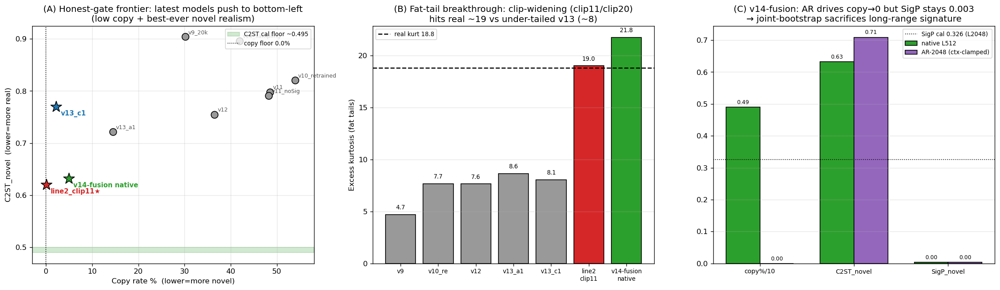

**图题：v13 之后最新模型三面板总览。**
- **(A) 诚实闸门前沿**（横轴复制率、纵轴 C2ST_新颖，左下=又新颖又真实）：历史模型（灰）沿"少记忆↔签名好"散布；**最新三星把前沿推到左下角**——line2 clip11（复制 0.02% / C2ST 0.620，史上最优）与 v14-fusion native（复制 4.9% / C2ST 0.632）双双逼近 C2ST 标定带（绿，~0.495），C1（复制 2.2% / C2ST 0.770）在其上方。即**首次有模型同时把复制率压到硬约束附近 AND 把新颖真实度推到史上最优**，但与标定地板仍有残差（弥散 floor = 数据稀缺指纹）。
- **(B) 厚尾突破**（峰度，黑虚线=真实 18.8）：v13 A1/C1 等欠厚尾族卡在 ~8（clip8 天花板）；**放开 clip（clip11/clip20）后峰度命中真实 ~19–22**——line2 clip11≈19、v14-fusion native=**21.7** 无过冲。这是历代首次在厚尾上达成真实量级。
- **(C) v14-fusion bootstrap 长程取舍**（native vs AR-2048）：AR 把复制率打到 **0.0%**、C2ST 仍 0.71，**但 SigP_新颖在 native 与 AR 下都钉死 0.003**（远低于 L2048 标定 0.326）——即便 ctx 钳位把 AR 数值修稳（kurt 80→25），签名仍塌。**决定性证据：长程签名塌不是自回归发散导致，而是 joint block-bootstrap(BOOT_FRAC=0.3) 用 30% 块乱序窗买来低复制率、代价是 2048 尺度连贯结构**（对照无 boot 的 C1，AR 能把 SigP 修到 0.106）。

> 补充图表：line2 clip11 的逐项 stylized fact / clip 曲线 / 弥散 floor 见 `outputs/figures/line2_report/`（`PROJECT_SUMMARY_line2.md`）；全 11 模型财务真实度记分卡热图见 `outputs/figures/final_report/F9_scorecard_heatmap.png`（`final_report.md`）。

### 5.5.3 判读：最新模型如何改写结论

1. **A1 的两大代价（签名塌 + 长程塌）已被 C1 机制性修好**——证明缩窗的硬伤是可修的，富条件自回归是有效补丁（消融门过）。
2. **"无模型能生成令人信服的新颖数据"被部分改写但未推翻**：clip11/v14-fusion 把 C2ST_新颖从历史 0.75–0.90 压到 **0.62–0.63**（史上最优）AND 同时拿下低复制 + 真厚尾——**比 A1 报告时的认知前进了一大步**；但 0.62 仍 > 标定 0.495，残差被诊断证实是**弥散多特征微弱分离（数据稀缺指纹）**，非任何单一可修特征。**"既新颖又逼真"在 ~7 个独立窗约束下仍未完全达标，但天花板已从"全模型 0.72+"降到"0.62"。**
3. **多通道不是数据稀缺的解药**：v14-fusion 诚实标注多通道**本身不增独立窗**（28.8→23.8 反降），其复制率改善全靠 joint-boot/context-cond/L512 三杠杆——**再次坐实头号病根仍是数据稀缺，治本唯一方向仍是不失真增独立信号（B1 真数据）。**
4. **新的明确下一步**：v14-fusion 降 BOOT_FRAC 重训以恢复长程签名（native 已是强交付，只差 AR 长程）；line2 模型侧杠杆已耗尽，唯 B1 多资产真数据。

---

## 6. 详尽可视化分析

### 6.1 诚实排名演化

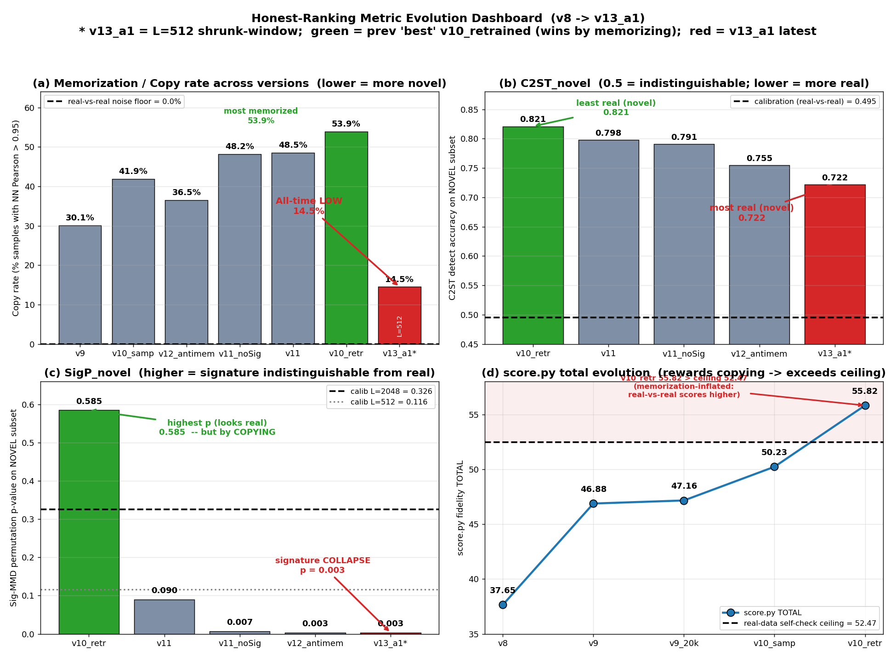

**图题：诚实排名核心指标跨版本演化仪表板。** 四子图汇总跨版本演化，红色高亮最新 v13_a1，绿色为既往最佳 v10 重训（其优势源自记忆化抄袭）。
- **(a) 复制率**：real-vs-real 底噪=**0.0%** 为黑虚线基准；**v13_a1=14.5%**（L=512 口径）为史上最低（All-time LOW），既往最佳 v10 重训反而记忆最多（**53.9%**），v9→v10采样→v11→v10重训 呈逐步恶化——既往真实度排名被记忆化**反向污染**。
- **(b) C2ST_新颖**（越低越接近标定 **0.495**、越真）：**v13_a1=0.722** 史上最真，**v10重训=0.821** 在新颖子集上最易被识破。
- **(c) SigP_新颖**（越高越像真，标定 L2048=0.326 / L512=0.116）：**v10重训 p=0.585** 最高但靠抄袭训练窗才显真，**v13_a1 p=0.003** 出现签名塌缩。
- **(d) score.py 总分**：37.65→46.88→47.16→50.23→**55.82**，真实自检上限=**52.47** 为黑虚线；**v10 重训 55.82 越过上限**，揭示旧打分器奖励复制致分数虚高、不可作真实度凭据。

**关键统计量**：复制率 v9=**30.1%** / v10采样=**41.9%** / v12=**36.5%** / v11noSig=**48.2%** / v11=**48.5%** / v10重训=**53.9%** / v13_a1=**14.5%**（底噪 **0.0%**）；C2ST_新颖 v13_a1=**0.722** < v12=0.755 < v11noSig=0.791 < v11=0.798 < v10重训=**0.821**（标定 0.495）；SigP_新颖 v10重训=**0.585** > v11=0.090 > v11noSig=0.007 > v12=0.003 = v13_a1=**0.003**。

### 6.2 典型事实（stylized facts）

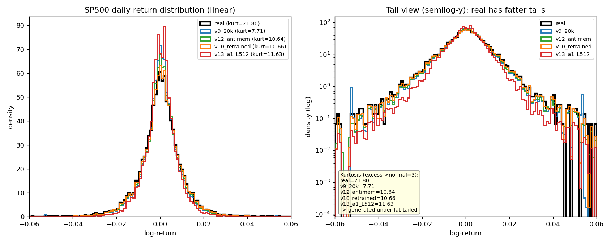

**图题：SP500 日收益分布对比（线性 + 半对数尾部，标注峰度）。** 左图线性密度：真实分布峰更高更尖（leptokurtic），生成样本峰略钝。右图半对数 y 轴专看尾部：真实在 |r|>0.03 区段密度系统性高于所有生成样本，直观显示生成普遍**欠厚尾 / 欠离散**。峰度（normal=3）：真实 **21.80** 远高于 v9 **7.71**、v12 **10.64**、v10重训 **10.66**、v13_a1 **11.63**——**所有生成模型峰度仅约真实的 1/3 到 1/2**，印证关键发现 1（过平滑 / 欠离散）。

**关键统计量**：峰度 real=**21.80** vs v9_20k=**7.71** / v12=**10.64** / v10重训=**10.66** / v13_a1=**11.63**；std real=**0.01055** / v10重训=**0.01003** / v13_a1=**0.0077**。

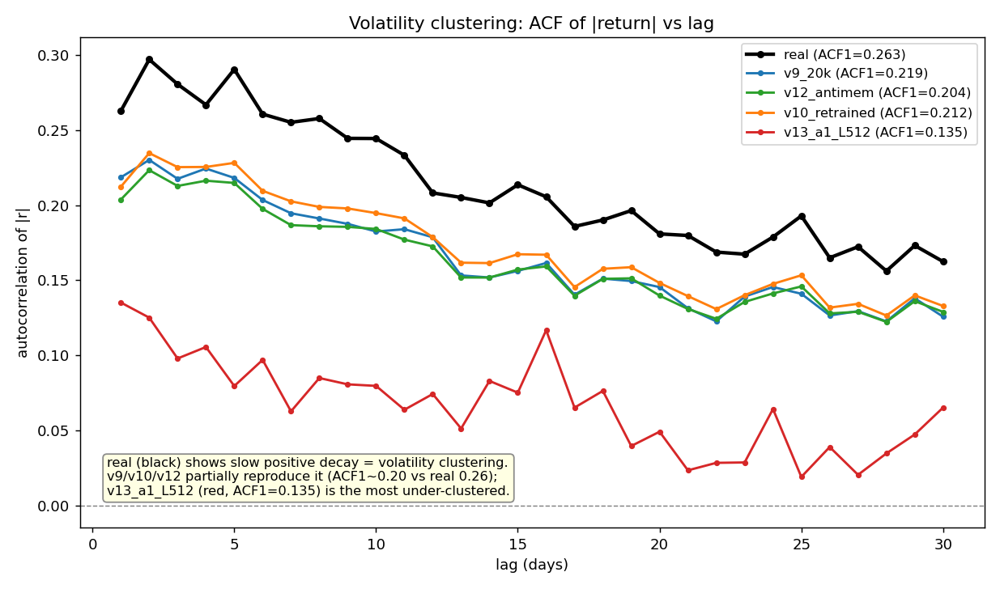

**图题：波动聚集——|收益| 的自相关 ACF vs lag (1..30)。** 真实数据呈缓慢正衰减，**ACF1=0.263** 且 lag 30 仍维持 ~0.16（显著持久的波动聚集）。v9 / v10重训 / v12 部分复现（ACF1 ~0.20-0.22，但整条曲线系统性低于真实、衰减更快）。**v13_a1（ACF1=0.135）最弱，几乎是真实的一半**——是所有模型中波动聚集最欠缺者，与缩窗 L=512 + 抗记忆带来的更平滑路径一致。

**关键统计量**：ACF1(|r|) real=**0.263** > v9_20k=**0.219** > v10重训=**0.212** > v12=**0.204** > v13_a1=**0.135**。

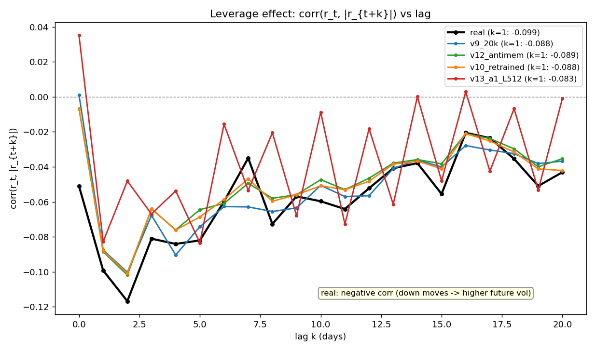

**图题：杠杆效应 corr(r_t, |r_{t+k}|) vs lag。** 真实数据各 lag 处为持续负相关（k=1 处 **−0.099**，短 lag 段普遍 −0.08 到 −0.12），即下跌后未来波动放大的杠杆 / 反馈效应。v9 / v10重训 / v12 大体复现形状与量级（k=1 约 −0.088 到 −0.089，表现尚可）。**v13_a1 在最短 lag 出现正向尖刺并整体抖动剧烈**，杠杆结构刻画最不稳定（单样本仅 512 长使逐样本相关估计方差更大）。

**关键统计量**：leverage k=1 real=**−0.099** / v9=**−0.088** / v12=**−0.089** / v10重训=**−0.088** / v13_a1=**−0.083**。

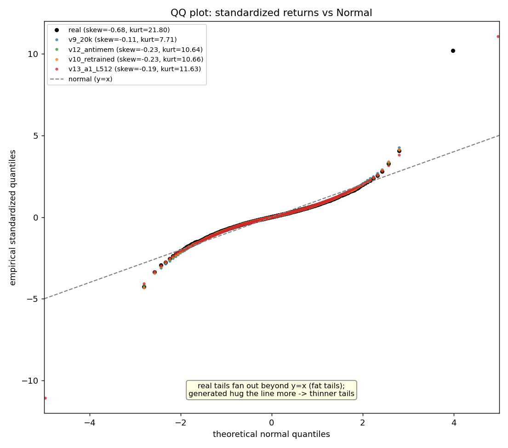

**图题：QQ 图——标准化收益 vs 正态（突出厚尾）。** 灰虚线 y=x 为正态参照。真实在两端明显偏离 y=x 向外张开（右尾点冲到 ~+10、左尾 ~−4.3 远超正态，表征厚尾）。生成样本整体更贴合 y=x、尾部张开幅度小于真实，即**欠厚尾**。偏度：真实 **skew=−0.68**（左偏）远强于各生成模型（−0.11 到 −0.23）。v13_a1 出现一个 −11 孤立极端左尾点（缩窗样本偶发离群，不改整体欠厚尾结论）。

**关键统计量**：skew real=**−0.68** vs v9=**−0.11** / v12=**−0.23** / v10重训=**−0.23** / v13_a1=**−0.19**；峰度 real=**21.80** vs 生成 7.71-11.63。

### 6.3 诊断三族（roughness / regime / PSD）

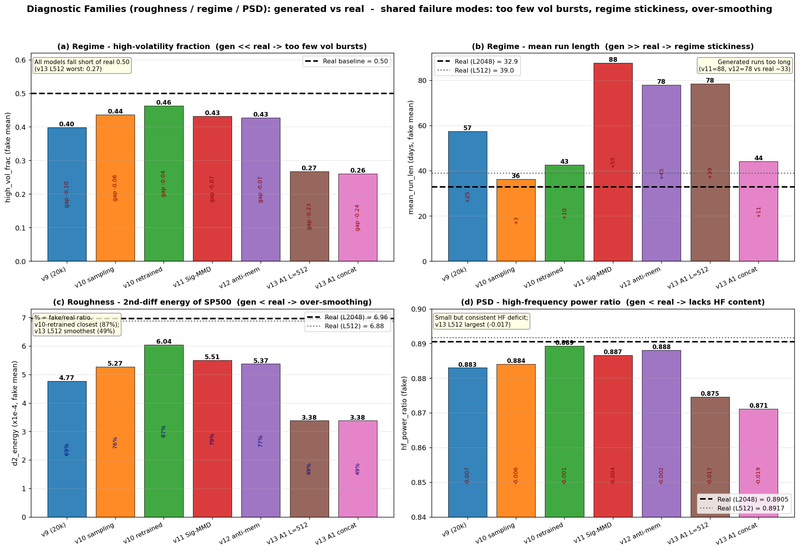

**图题：诊断三族（roughness/regime/PSD）对比——生成 vs 真实。** 2x2 多子图，统一以真实数据为基准。
- **(a) regime·高波动占比**：真实=**0.50**，所有生成偏低（波动爆发不足），v9=0.40、v10重训=**0.46**（最接近）、v11=0.43、v12=0.43，**v13 缩窗 L512=0.27、concat=0.26 最差（gap ~−0.24）**。
- **(b) regime·平均持续长度**：真实(L2048)~**33**，生成普遍偏长（regime 黏滞），v11=**88**、v12=78、v13_a1_L512=78（对其 L512 真实 39 仍 +39）、v9=57，只有 v10采样=**36** 最接近。
- **(c) roughness·二阶差分能量**（过平滑量具，x1e-4）：真实=**6.96**，生成均更低（过平滑），v10重训=**6.04**（=87% 最接近真实、最不平滑），**v13_a1_L512=3.38（49%）最平滑**。
- **(d) PSD·高频功率占比**：真实~**0.8905**，生成有小而一致的高频缺口，v10重训=0.8893（缺口最小），**v13_a1_L512=0.8746（−0.017）缺口最大**。

**综合**：v10 重训在 roughness/PSD/run_len/high_vol 四项上均最接近真实（但记忆化复制率最高 53.9%）；v13 缩窗虽降记忆化却在所有诊断族上更过平滑、波动更不足——印证 Pareto 张力。

**关键统计量**：high_vol_frac（真实 0.50）v10重训=**0.46** / v13_L512=**0.27**；mean_run_len（真实 33）v10采样=**36** / v11=**88** / v13_L512=**78**；d2_energy x1e-4（真实 6.96）v10重训=**6.04(87%)** / v13_L512=**3.38(49%)**；hf_power_ratio（真实 0.8905）v10重训=0.8893 / v13_L512=**0.8746**。

### 6.4 数据稀缺 Pareto 张力

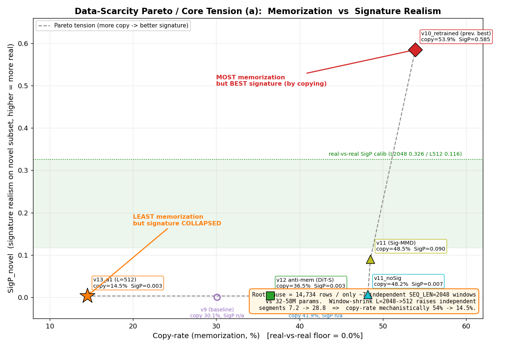

**图题：数据稀缺 Pareto 核心张力 (a)——记忆化 vs 签名真实度 SigP_novel。** 全项目最关键的权衡图。横轴复制率（底噪 0.0%），纵轴 SigP_novel（越高越像真）。七个模型沿一条清晰**负相关 Pareto 前沿**排列：右上角 **v10_retrained 复制最多（53.9%）却签名最好（SigP=0.585，唯一进入 real-vs-real 标定带 0.116-0.326）**——但这种"真实"实为"靠抄"（半数输出近乎逐点复制训练窗）；左下角 **v13_a1 复制最少（14.5%）但签名彻底塌陷（SigP=0.003）**。中间 v11（0.090）、v11_noSig（0.007）、v12（0.003）依记忆化递减、签名同步恶化。**在仅 ~7 个独立 2048 窗的数据稀缺下，无任何配置能同时拿下"新颖+逼真"。**

**关键统计量**：复制率 v9=30.1% / v10采样=41.9% / v12=36.5% / v11noSig=48.2% / v11=48.5% / v10重训=**53.9%** / v13_a1=**14.5%**；SigP_novel v10重训=**0.585** / v11=0.090 / v11noSig=0.007 / v12=0.003 / v13_a1=**0.003**（标定 L2048=0.326 / L512=0.116）。

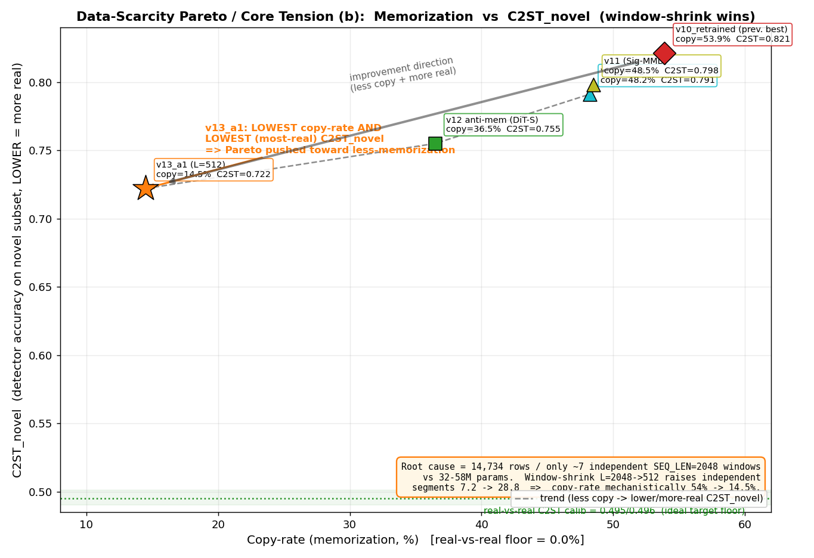

**图题：数据稀缺 Pareto 核心张力 (b)——记忆化 vs C2ST_novel（缩窗胜出）。** 纵轴换 C2ST_novel（越低越接近 0.495 标定→越真）。趋势线显示复制率越低、C2ST_novel 越低（越真）：v10重训 53.9%/0.821（最差），v11、v11_noSig、v12 依次改善，**v13_a1 位于左下角同时取得最低复制率（14.5%）与最低 / 最真的 C2ST_novel（0.722）**——唯一在两维度同时领先的模型。但与标定地板（0.495/0.496）仍有显著差距，说明缩窗虽机制性压低记忆化、却仍未生成令人信服的新颖数据。与 (a) 互补：(a) 显示缩窗令签名塌、(b) 显示缩窗令 stylized/C2ST 更真——**单靠缩窗无法两全，治本唯一方向是扩充数据。**

**关键统计量**：复制率/C2ST_novel v10重训=**53.9%/0.821** / v11=48.5%/0.798 / v11noSig=48.2%/0.791 / v12=36.5%/0.755 / v13_a1=**14.5%/0.722**（C2ST 标定 0.495/0.496）。

### 6.5 路径与价格

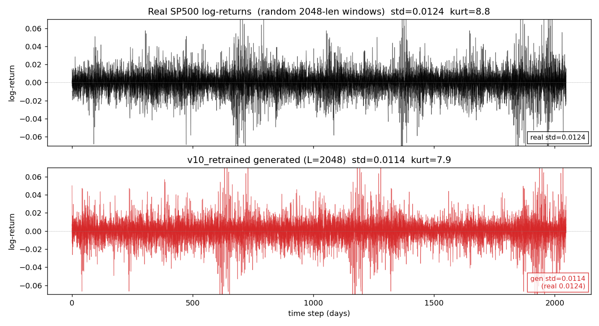

**图题：示例收益路径——Real vs v10_retrained (L=2048)。** 上排黑色真实 SP500 日 log 收益的随机 2048 滑窗（std=**0.0124**, kurt=**8.8**），下排红色 v10_retrained 6 条样本（std=**0.0114**, kurt=**7.9**）。两者波动幅度、波动爆发、厚尾形态高度接近，v10_retrained 逐点波动只略低于真实——整体形态最逼真，与既往最佳定位一致。

**关键统计量**：real std=**0.0124** / kurt=**8.8**；v10 std=**0.0114** / kurt=**7.9**。

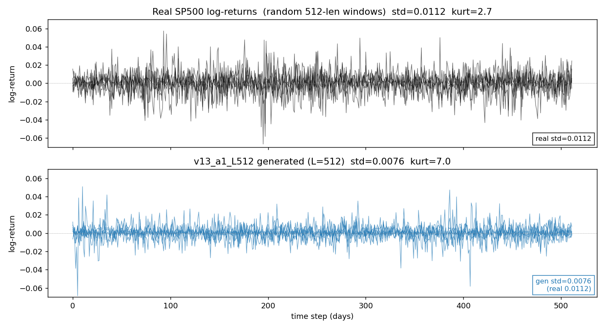

**图题：示例收益路径——Real vs v13_a1_L512 (L=512)。** 上排黑色真实 512 滑窗（std=**0.0112**, kurt=2.7，短窗峰度天然偏低），下排蓝色 v13_a1_L512 样本（std=**0.0076**, kurt=7.0）。v13_a1 明显**欠离散 / 过平滑**：逐点 std 仅 0.0076 远低于真实 0.0112、波动爆发稀疏。印证 regime high_vol_frac 仅 **0.27**（真实 0.50）——缩窗虽把复制率压到 14.5%，但代价是波动结构塌缩。

**关键统计量**：real std=**0.0112**；v13 std=**0.0076**（欠离散） / kurt=7.0；high_vol_frac **0.27** vs 真实 **0.50**。

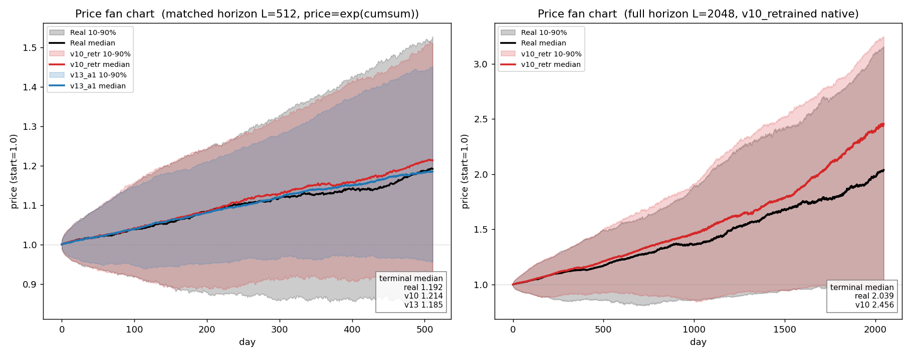

**图题：价格重建 Fan Chart——exp(cumsum 收益)，中位 + 10/90% 分位带。** 起点 1.0，阴影为 10-90% 分位带。左（L=512 三方对比）：真实终值中位 **1.192**，v10_retrained **1.214**（略偏高且分位带最贴合真实），v13_a1 **1.185**（中位接近但分位带明显偏窄，反映终值方差不足）。右（v10 原生 L=2048）：真实终值中位 **2.039**，v10 为 **2.456**——长程上 v10 价格漂移与不确定性带均偏高，提示长地平线下的趋势偏置。

**关键统计量**：L512 终值中位 real **1.192** / v10 **1.214** / v13 **1.185**；L2048 real **2.039** / v10 **2.456**。

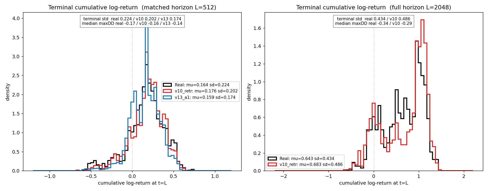

**图题：终值（累计 log 收益）分布——均值/标准差/最大回撤标注。** 左（L=512）：真实 mu=0.164/sd=**0.224**，v10_retrained mu=0.176/sd=**0.202**（与真实最接近），v13_a1 mu=0.159/sd=**0.174**（分布更尖窄、尾部更收，**sd 明显不足，再次体现欠离散**）；中位最大回撤 real **−0.17** / v10 **−0.16** / v13 **−0.14**（v13 回撤偏小，因波动被压低）。右（L=2048）：真实 mu=0.643/sd=**0.434**，v10 mu=0.683/sd=**0.486**（均值与方差均略高，终值分布整体右移）。

**关键统计量**：终值 std L512 real=**0.224** / v10=**0.202** / v13=**0.174**；maxDD L512 real=**−0.17** / v10=**−0.16** / v13=**−0.14**；L2048 std real=**0.434** / v10=**0.486**。

---

## 7. 关键发现与结论

1. **过平滑 / 欠离散是结构性病根（非过粗糙）**：所有生成器路径比真实更平滑、波动爆发不足、regime 太黏、收益率过持续，源于 eps-MSE mode-averaging + DDIM 末步输出 x0 均值；SP500 峰度全模型仅 4.3–8.8，远低于真实 18.8，std 普遍偏小。

2. **ddpm_mse 自指缺陷**：score.py 该项（原权重 0.20）衡量样本到模型自身过平滑流形的距离而非到真实数据的距离，反而惩罚了更真实的 v10 重训（旧打分 44.39 vs 取证重打 55.82）。判生成质量**绝不能用 ddpm_mse / score.py 总分把关**，要用 wasserstein / 峰度 / diagnostics / 非自指鉴别器。

3. **签名（path signature）是脊梁**：同一 `D(P_real,Q)` 型两样本散度既是生成器潜在训练损失又是假数据取证打分器；Sig-MMD 在 p=0.003 揪出 v9 / v10采样，却无法区分 v10重训与真实（p=0.395）。

4. **更低训练 eps-MSE != 更真样本**：v11 把 eps-MSE 从 0.61 过优化压到 ~0.001，却在所有非自指判据上回退——是过平滑病根的更严重版本；在仅 ~7 个独立窗上过优化去噪目标 = 记忆化。

5. **Sig-MMD 辅助损失是无效死重（no-op）**：v11（开）vs v11_noSig（关）复制率 48.5% vs 48.2%、C2ST_新颖 0.798 vs 0.791、SigP_新颖 0.090 vs 0.007 几近全等；in-batch@w=0.05 早早（ep~190）卡 MMD² 噪声地板 ~−0.001 无持续梯度，可删。

6. **头号病根 = 全模型严重记忆化训练集 / 数据稀缺**：复制率（底噪 0.0%）v10重训 53.9% / v11 48.5% / v10采样 41.9% / v9 30.1%，近半数生成样本是训练窗近乎逐点复制（Pearson 0.9999）；根因是 14734/2048≈7.2 个独立宏观窗 << 58M 参数。

7. **既往真实度排名被记忆化污染**：复制率反相关于既往真实度排名——"最佳" v10重训复制最多；诚实排名（只看新颖子集）显示所有模型 C2ST_新颖 0.72–0.90 >> 标定 0.495，**无模型能生成令人信服的新颖数据**。

8. **记忆化与过平滑构成 Pareto 张力且被锁死**：多记忆→签名好但复制多（v10重训 SigP 0.585 / 复制 53.9%）；少记忆→复制少 + stylized 好但签名塌 / 过平滑（v12 SigP 0.003 / 复制 36.5%）；无配置 / 架构 / 损失能同时拿下 novel + realistic。

9. **v13 A1 缩窗机制性降记忆化但牺牲签名与长程**：独立段 7.2→28.8（×4）使复制率降到史上最低 14.5%、C2ST_新颖史上最优 0.722，但 SigP_新颖塌到 0.003，且长程塌陷——拼回 2048 后 regime mean_run_len 仍 44 vs 真实 33、std 萎缩 0.0077 vs 0.0105、high_vol_frac gap −0.24。**短窗装不下多年牛熊 regime 与长程 |r|-ACF 慢衰。**

10. **评估方法学教训**：必须用 L 自身重标定的 real-vs-real 地板判定（L=512 与 L=2048 标定不同，不可跨尺度套用）；长程 / regime 指标必须在拼回 2048 全长上跑，防"短尺度漂亮、长程已塌"盲区；go/no-go 北极星 = C2ST_新颖 / SigP_新颖 + 复制率。

11. **治本唯一方向 = 数据**：模型侧（损失 / 架构 / 采样 / 正则）只在同一堵 58M/7 的墙上挪 Pareto，缩窗已是模型侧极限；真路只有不失真增独立信号的数据侧。

---

## 8. 当前进行中 & 下一步

### 8.1 v13 C1 / line2 / v14-fusion（已评定，详见 §5.5）

- **C1 已评定**：消融门过、发散仅 2/5118 行经 ⑦ x0 钳位治愈；复制 2.2% / SigP_新颖 0.106 / 长程已修，唯一未达标=欠厚尾（峰度 8.06）。早期"数值发散（std≈0.105/峰度≈40026）"已定位为稀疏单窗失稳、非全局问题。
- **line2 已收官**：clip11 ★ = 低复制硬约束（0.02%）+ C2ST_新颖史上最优（0.620）+ 厚尾达标；模型侧杠杆耗尽，唯 B1 真数据。
- **v14-fusion native 已交付**：历代最强单窗（真实度+复制率双优）；**唯一待办 = 降 BOOT_FRAC 0.3→0.1~0.15 重训 `fusion/v14_lowboot`**，恢复 AR-2048 长程签名（native 已强交付，ctx 反馈钳位修复已就位，AR 直接可用，代价 ~5h）。

### 8.2 备件 / 旁支（默认关）

- **A2 block-bootstrap**：`_make_boot_window` 已实现（BLOCK_LEN=192 真实块首尾相接 + 随机裁剪，BOOT_FRAC=0.3），保块内 stylized fact、只造新宏观次序，绝不凸组合 / 插值 / 加噪。备用于扩充独立次序排列。
- **B1 多资产同构对预训练**：用更多资产（同构双通道对）扩充独立信号源。
- **B2 GARCH**：以 GARCH 类合成 / 混合补充波动结构（需防失真）。

### 8.3 v13 数据治本路线（Step0–4）

模型侧已到极限，治本路线全部指向**不失真地增加独立信号**：缩窗（A1，已做）→ 富条件自回归长程修补（C1，已修签名/长程）→ 攻厚尾 clip 解封（line2 clip11/v14-fusion，已达真实厚尾）→ block-bootstrap（A2，v14 已联合启用，但证其牺牲长程签名）→ **多资产同构对预训练（B1，唯一未做的真·数据侧治本）**→ 更长历史 / 更多资产数据。**最新认知（§5.5）：模型侧三杠杆（缩窗+富条件+clip）已把 C2ST_新颖天花板从 0.72+ 压到 0.62、厚尾命中真实，但残差是数据稀缺指纹——B1 真数据是唯一剩余真路。**详见 `~/src/eval/docs/v13_data_plan.md` 与 `eval/docs/v14_fusion_plan.md`。

---

## 9. 附：关键统计指标速查表

| 指标 | 真实 / 标定 | 当前关键模型读数 |
|---|---|---|
| **真实 SP500 std** | **0.01055** | v10重训 0.01003 / v13_a1 **0.0077**（欠离散） |
| **真实 SP500 超额峰度** | **18.80**（全集）/ 21.80（3000样本） | v9 4.71 / v10重训 7.66 / v13_a1 8.63（旧族仅 1/3–1/2）；**clip11 ~19 / v14-fusion native 21.7（命中真实）** |
| **真实 SP500 偏度** | **−0.679** | 生成 −0.11 ~ −0.23（欠左偏） |
| **真实 \|r\| ACF1** | **0.263** | v10重训 0.212 / v13_a1 **0.135**（最弱波动聚集） |
| **复制率底噪（real-real）** | **0.0%** | — |
| **复制率（越低越好）** | 0.0% | v9 30.1% / v10重训 **53.9%（最差）** / v13_a1 14.5% / C1 2.2% / **clip11 0.02% / v14 native 4.9% / v14 AR 0.0%（史上最低档）** |
| **C2ST_新颖（越接近标定越好）** | L512 **0.4965** / L2048 0.495 | v10重训 0.821 / v13_a1 0.722 / C1 0.770 / **clip11 0.620 / v14 native 0.632（并列史上最优，天花板 0.72+→0.62）** |
| **SigP_新颖（越高越好）** | L2048 **0.326** / L512 **0.116** | v10重训 0.585（靠抄）/ v13_a1 0.003 / C1 **0.106（半修复）** / **clip11 0.362 PASS** / v14 0.003（被 bootstrap 牺牲） |
| **跨通道结构（v14 多通道）** | corr(sp,dgs2)≈真实曲线斜率 | **v14-fusion native forensic_cross cross_gain≈0**（曲线结构逼真）；多通道**不增独立窗**(28.8→23.8) |
| **score.py 自检上限** | **52.47** | v10重训取证重打 **55.82（越上限→旧打分虚高）** |
| **regime mean_run_len** | L2048 ~**33** | v10采样 36（最近）/ v11 88 / v13 concat 44.16 |
| **regime high_vol_frac** | **0.50** | v10重训 0.46 / v13_L512 **0.27（波动爆发严重不足）** |
| **roughness d2_energy (x1e-4)** | **6.96** | v10重训 6.04(87%) / v13_L512 **3.38(49%，最平滑)** |
| **独立宏观窗数** | L2048 **≈7.2** / L512 **≈28.8** | vs 58M 参数（数据稀缺=头号病根根因） |
| **eps-MSE 过优化地板** | — | v11 压到 **~0.001（反而样本更差）** |
| **DiT-B / DiT-S 实测参数** | — | **57.93M** / **32.64M**（seq_len=512） |
| **v13 C1 自回归发散（已治）** | 真实 std 0.0105 | 仅 2/5118 行单窗失稳，⑦ x0 钳位治愈;干净 C1 复制 2.2% / SigP 0.106 |
| **line2 clip11 ★(N=5120)** | 复制 0% / C2ST 0.495 / SigP 0.326 | 复制 **0.02%** / C2ST_新颖 **0.620** / SigP **0.362 PASS** / 峰度~19 |
| **v14-fusion native ★(N=5120)** | 复制 0% / C2ST 0.496 / SigP 0.116 | 复制 **4.9%** / C2ST_新颖 **0.632** / 峰度 **21.7** / 综合 **63.5** / cross_gain≈0 |

---

*报告完。当前分支 `deep_v10`(v13 实验在此分支推进)。下一步详见 `~/src/eval/docs/v13_data_plan.md`。*
