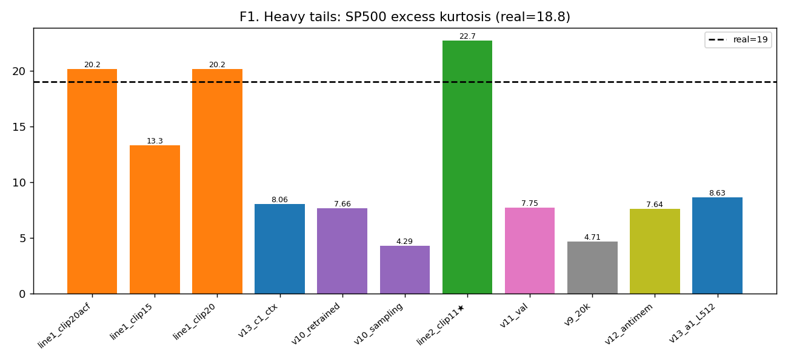
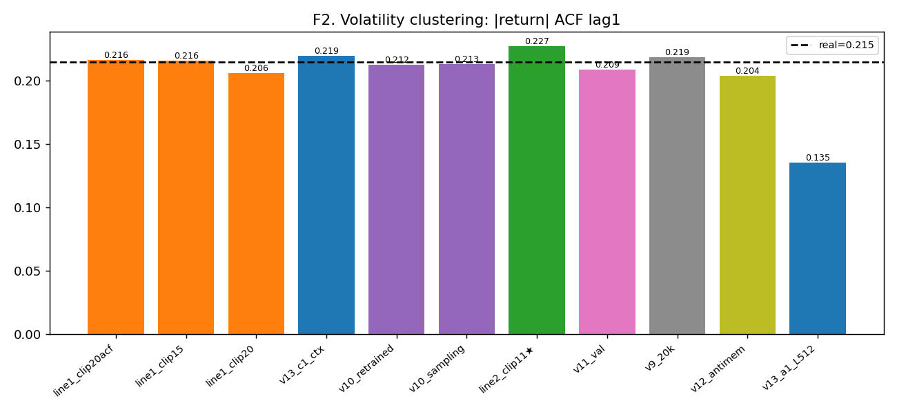
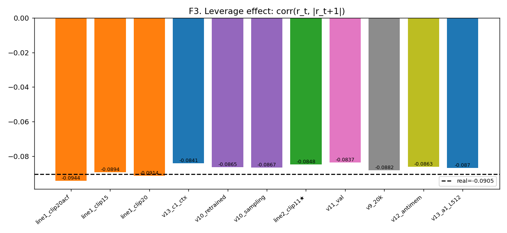
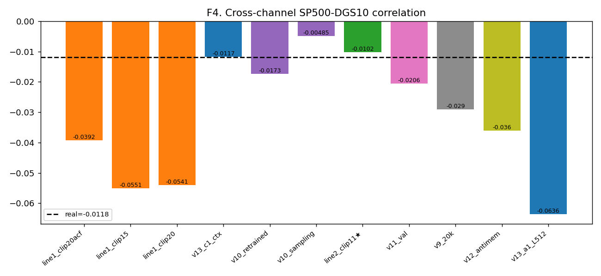
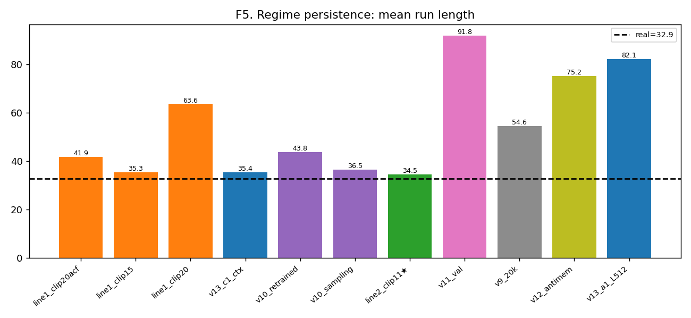
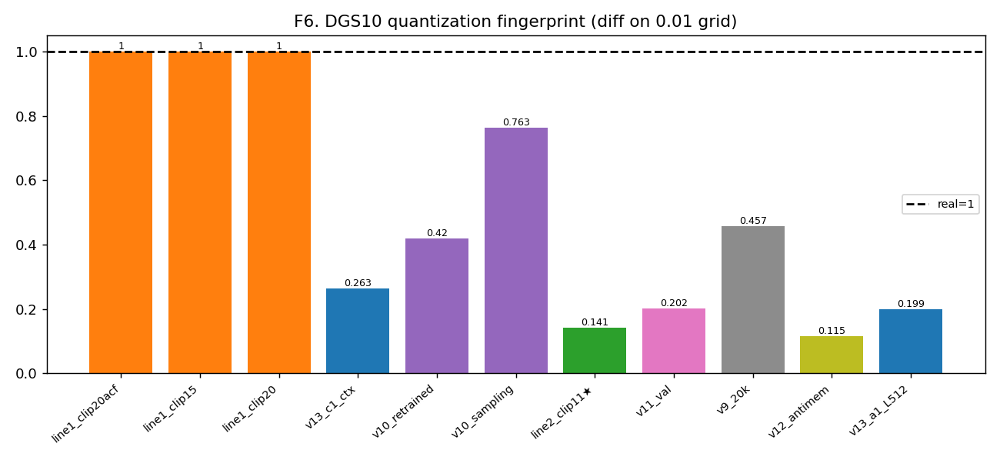
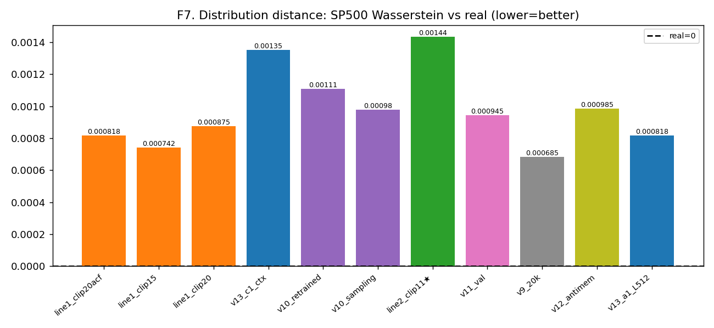
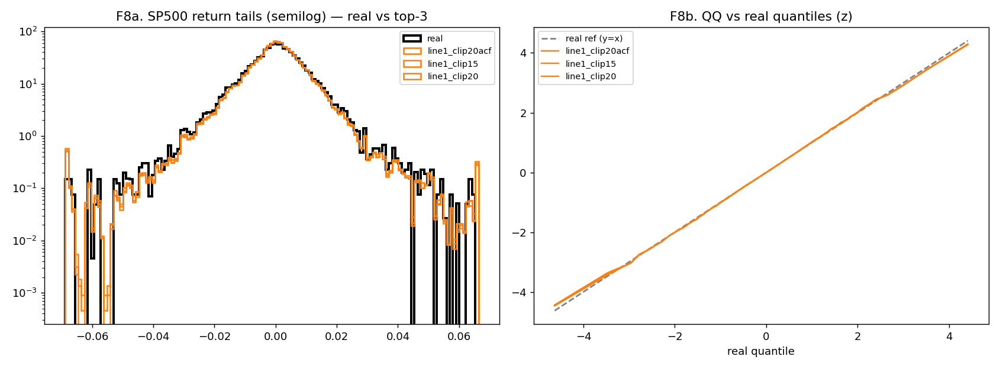
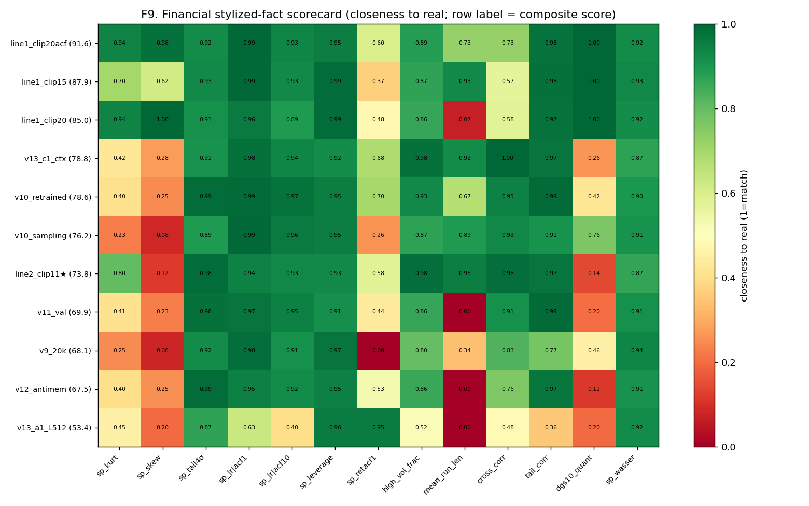

# final_report.md — 全模型金融典型事实评估(all-in-one)

> 由 `eval/final_eval.py` 一次性生成:对 11 个模型 + 真实基线,评估【核心金融统计指标 + 厚尾 + 双通道常见指标】,配 9 张图。每模型抽样 3000 窗(峰度/ACF/杠杆 N-稳定)。图内英文、正文中文。

## 0. 评估标准(精简自 eval/)

**保留(财务典型事实)**:分布矩(std/skew/**峰度**)、**厚尾**(峰度/|z|>4σ频率/尾部/QQ)、波动聚集(|r|-ACF lag1/10)、杠杆效应(corr(r_t,|r_t+1|))、收益自相关(ret-ACF1)、regime(high_vol_frac/mean_run_len/vol_of_vol)、长程(|r|-ACF lag20)、跨通道(corr+尾相关)、DGS10量化指纹、Wasserstein 分布距离。

**筛掉(次要/自指/冗余)**:`ddpm_mse`(自指,衡量到模型自身流形非真实)、`score.py` 加权总分(被自指污染)、patch-16 spike(生成伪影非财务事实)、switch_rate/tv/max_rolling_vol(与 run_len/d2 冗余)、C2ST/Sig-MMD/copy_rate(属【新颖度/记忆化】另一轴,见 forensic_suite/scoreboard,本表不混入财务真实度)。

> **财务真实度综合分** = 13 项核心指标对真实值的 closeness 均值×100(1=完全匹配)。**非地面真值裁判**,各单项才是依据。

## 1. 总排名(按财务真实度综合分)

**最真实(财务典型事实):`line1_clip20acf` = 91.6**。

| 模型 | 综合分 | 峰度 | 偏度 | \|z\|>4σ | \|r\|acf1 | \|r\|acf10 | 杠杆 | retACF1 | high_vol | run_len | 跨通道corr | 尾相关 | DGS量化 | sp_Wasser |
|---|---|---|---|---|---|---|---|---|---|---|---|---|---|---|
| **真实** | — | 19.01 | -0.76 | 0.58% | 0.215 | 0.200 | -0.091 | 0.015 | 0.50 | 32.9 | -0.012 | 0.110 | 1.00 | 0 |
| line1_clip20acf | 91.6 | 20.18 | -0.77 | 0.54% | 0.216 | 0.187 | -0.094 | 0.035 | 0.44 | 41.9 | -0.039 | 0.114 | 1.00 | 0.0008 |
| line1_clip15 | 87.9 | 13.33 | -0.49 | 0.54% | 0.216 | 0.185 | -0.089 | 0.047 | 0.44 | 35.3 | -0.055 | 0.107 | 1.00 | 0.0007 |
| line1_clip20 | 85.0 | 20.15 | -0.76 | 0.53% | 0.206 | 0.178 | -0.091 | 0.041 | 0.43 | 63.6 | -0.054 | 0.106 | 1.00 | 0.0009 |
| v13_c1_ctx | 78.8 | 8.06 | -0.25 | 0.64% | 0.219 | 0.212 | -0.084 | -0.001 | 0.49 | 35.4 | -0.012 | 0.115 | 0.26 | 0.0014 |
| v10_retrained | 78.6 | 7.66 | -0.23 | 0.58% | 0.212 | 0.195 | -0.087 | 0.030 | 0.46 | 43.8 | -0.017 | 0.109 | 0.42 | 0.0011 |
| v10_sampling | 76.2 | 4.29 | -0.11 | 0.65% | 0.213 | 0.191 | -0.087 | 0.052 | 0.44 | 36.5 | -0.005 | 0.097 | 0.76 | 0.0010 |
| line2_clip11★ | 73.8 | 22.73 | -0.14 | 0.59% | 0.227 | 0.214 | -0.085 | -0.006 | 0.49 | 34.5 | -0.010 | 0.115 | 0.14 | 0.0014 |
| v11_val | 69.9 | 7.75 | -0.22 | 0.59% | 0.209 | 0.189 | -0.084 | 0.043 | 0.43 | 91.8 | -0.021 | 0.109 | 0.20 | 0.0009 |
| v9_20k | 68.1 | 4.71 | -0.11 | 0.63% | 0.219 | 0.183 | -0.088 | 0.069 | 0.40 | 54.6 | -0.029 | 0.076 | 0.46 | 0.0007 |
| v12_antimem | 67.5 | 7.64 | -0.23 | 0.59% | 0.204 | 0.184 | -0.086 | 0.039 | 0.43 | 75.2 | -0.036 | 0.115 | 0.11 | 0.0010 |
| v13_a1_L512 | 53.4 | 8.63 | -0.19 | 0.51% | 0.135 | 0.080 | -0.087 | 0.017 | 0.26 | 82.1 | -0.064 | 0.014 | 0.20 | 0.0008 |

## 2. 可视化分析

### F1_kurtosis.png

**厚尾(峰度)**:真实 SP500 超额峰度 18.8;各模型普遍欠厚尾(过平滑老病),line1 clip20/clip20acf 与 line2 clip11 放开 clip 后峰度最接近真实。

### F2_volcluster_acf1.png

**波动聚集**:|收益| 一阶自相关,真实 ~0.22;反映波动率的持续性(GARCH 效应)。

### F3_leverage.png

**杠杆效应**:corr(r_t,|r_{t+1}|),真实为负(下跌后波动放大)。

### F4_cross_corr.png

**双通道相关**:SP500↔DGS10 当期相关,真实近零/弱负。

### F5_regime_runlen.png

**regime 持久性**:高/低波动状态平均游程长度,衡量波动聚集的宏观尺度。

### F6_dgs_quant.png

**DGS10 量化指纹**:真实利率差分落 0.01 网格占比 ~0.66;扩散模型多塌成连续浮点(≈0),是其结构硬伤。

### F7_wasserstein.png

**分布距离**:SP500 收益分布到真实的 Wasserstein 距离(越低越真)。

### F8_tails_qq.png

**尾部 + QQ**:综合分 top-3 模型的收益尾部(半对数)与 QQ 图(vs 真实分位),直观看厚尾还原度。

### F9_scorecard_heatmap.png

**财务真实度记分卡热图**:模型×指标的 closeness(绿=贴合真实/红=偏离),行按综合分排序——一图看全。

## 3. 关键结论

- **财务真实度最优 = `line1_clip20acf`**(综合分 91.6);放开 CLIP 攻厚尾的模型(line1 clip20系 / line2 clip11)峰度最接近真实,印证'欠厚尾'是过平滑历代主病、clip 是其旋钮。

- **DGS10 量化指纹**是所有扩散模型的共同硬伤(生成连续浮点 vs 真实 0.01 网格)——这是确定性的'非真实'抓手,与峰度/波动聚集正交。

- **峰度高方差**:抽样口径影响大,综合分以多指标 closeness 平滑单指标噪声;最终裁判看单项 + 图。

- 本表只评【财务真实度】;【新颖度/记忆化】(复制率/C2ST_新颖)是另一轴,见 `forensic_suite.py`/`scoreboard.py`;外部 hw01 见 `THIRDPARTY_CLAUDE.md`。
